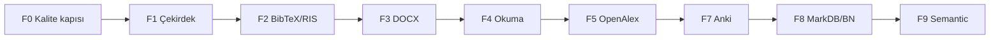

<!-- @ajan: cursor · @etiket: yapilandirma, faz-plan, plugin, f5.2, f9.2 -->
# LibRart Pro — yapılandırma planı

**Bu belge:** LibRart (**Katman 3**) yol haritası — fazlar, ayarlar, arayüz, kalite
kapıları, release. Dosya/OCR/pipeline **Katman 1**; PDF metadata **Katman 2** →
[`../../docs/uc-katman-stratejisi.md`](../../docs/uc-katman-stratejisi.md).

Giriş: [`LIBRART-GIRIS.md`](LIBRART-GIRIS.md) · Koordinasyon: [`AGENTS.md`](AGENTS.md)

---

## 1. Kimlik ve kod yapısı

| Alan | Değer |
|------|-------|
| Görünen ad | **LibRart Pro** |
| addonID | `librartpro@euclpts.com` |
| Kaynak repo | `sanaatchi/zotero-librart-pro` (= bu klasör) |
| Release repo | `sanaatchi/zotero-librart-pro-releases` |
| Sürüm | 1.0.40 |
| Lisans | AGPL-3.0-or-later |

| Klasör / dosya | Rol |
|----------------|-----|
| `src/` | TypeScript — modüller, utils, vendor |
| `addon/` | Manifest, locale (Fluent), statik varlıklar |
| `package.json` | Bağımlılıklar, scriptler |
| `zotero-plugin.config.ts` | Scaffold, build, updater |
| `test/` | Vitest (F0 sonrası zorunlu) |

### Mevcut özellik durumu

| Alan | Durum |
|------|-------|
| Bağlantı Haritası katmanları | `tag` ✅ · `manual` ✅ · `semantic` kısmi · `note` kısmi · `citation` kısmi (Crossref) |
| Inciteful, PDF kaynakça çıkarma | ✅ |
| Test (`npm test`) | ✅ Vitest — F0 (12 test) |
| Planlanmış modüller | `readingTracker`, `markdbBridge`, `openAlexCitationLayer`, … |
| Güvenli import (F2) | ✅ |
| DOCX cited (F3) | ✅ |

---

## 2. Mimari (kısa)

- **Katmanlar:** `tag` \| `manual` \| `semantic` \| `note` \| `citation` — `connectionGraph.ts`
- **Atıf alt kaynağı** metadata ile: `crossref` \| `openalex` \| `open-citations` (breaking change yok)
- **Yeni özellik:** `FeatureRegistry` + `ZoteroAdapter` — `src/core/`, `src/adapters/`
- **Vendor kodu:** `src/vendor/<ad>/` — kurallar entegrasyon planında

Refactor adayı büyük dosyalar: `connectionMapRenderer.ts`, `tagDashboard.ts`, vendor `views.ts`.

---

## 3. Faz planı (F0–F9) — sıralı, paralel yok



> **F6 (PDF Gelen Kutusu)** Katman 2’ye taşındı → [`zotero-pdf-manager/KATMAN-2-PLAN.md`](../zotero-pdf-manager/KATMAN-2-PLAN.md). LibRart’ta uygulanmayacak.

| Faz | Ne inşa edilir | Zorunlu çıktı |
|-----|----------------|---------------|
| **F0** | Güvenilir temel | Vitest, CI, provenance, updater/hash, Zotero sürüm matrisi |
| **F1** | Çekirdek stabil | FeatureRegistry, adaptör, regresyon testleri |
| **F2** | Güvenli import | ✅ `safeImportBridge.ts`, önizleme tablosu, seçili import | scholar-sidekick (MIT) |
| **F3** | DOCX kullanılanlar | ✅ `docxCitedBridge.ts`, `cited:` etiket + kayıtlı arama | zotero-tag-cited (MIT) |
| **F4** | Okuma durumu | Extra şeması, sütun, timeline filtresi | zotero-reading-flow (MIT) |
| **F5** | Atıf API | ✅ OpenAlex + **F5.2** OpenCitations (opt-in) | ZoteroCitationMaps (MIT) + Index API |
| ~~**F6**~~ | ~~PDF Gelen Kutusu~~ | **Katman 2** (PDF Manager otomasyon) — LibRart dışı | zotero-watch-folder → `KATMAN-2-PLAN.md` |
| **F7** | Anki | ✅ ince AnkiConnect istemci + Extra idempotans + menü | yanki-connect (MIT) — tam paket vendor yok |
| **F8** | Notlar | ✅ F8.1 MarkDB + F8.2.1 link + **F8.2.2** ilgili notlar; tam BN chrome → sonra | markdb-connect (MIT) + better-notes (AGPL) |
| **F9** | Semantic | ✅ F9.1–**F9.2.3** JSON indeks + findSimilar | ZotSeek (MIT) + ragPaper / köprü |

**Deneysel (çekirdek sonrası):** Citegeist, RefChecker, Kutuphane citation CLI — F0–F9 dışında.

### F0 — başlamadan önce geçmeli

| Madde | Durum |
|-------|-------|
| Vitest + saf fonksiyon testleri | ✅ `test/*.test.ts` |
| PR CI (`npm ci`, lint, build, test) | ✅ `.github/workflows/ci.yml` |
| Vendor provenance (`LIBRART-VENDOR.md`) | ✅ mevcut |
| Release `update_hash` | ✅ `zotero-plugin.config.ts` + `publish.mjs` |
| Zotero 7–10 manifest | ✅ `strict_min_version` 7.0 |
| YAML eylem import güvenlik şeması | ✅ `actionImportValidate.ts` |
| Zotero API tek adaptör | ✅ `src/adapters/zoteroAdapter.ts` — yeni kod; vendor kademeli |
| FeatureRegistry | ✅ `src/core/featureRegistry.ts` + `features.ts` |

**F0 kapanış:** tamam.

### F1 — çekirdek (tamamlandı)

| Madde | Durum |
|-------|-------|
| FeatureRegistry (startup / mainWindow fazları) | ✅ |
| ZoteroAdapter + test enjeksiyonu | ✅ |
| hooks.ts → registry orchestrasyon | ✅ |
| items / menu / inciteful → adaptör | ✅ |
| Regresyon testleri | ✅ 18 test |

### Her fazın ortak teslimi

Özellik bayrağı, kapatma yolu, idempotans, hata mesajı, tr-TR/en-US, provenance.
Toplu işlem → önce öğe sayısı + alan farkı önizlemesi.

---

## 4. Tercih anahtarları (`extensions.librartPro.*`)

| Pref | Faz | Varsayılan |
|------|-----|------------|
| `inciteful.enabled` | ✅ | true |
| `citation.layers.crossref` | ✅ | true |
| `citation.layers.openalex` | F5 | true |
| `citation.layers.openCitations` | F5.2 ✅ | false |
| `openalex.mailto` / `openalex.cacheDays` | F5 | `""` / 30 |
| `reading.enabled` | F4 | true |
| `import.enabled` | F2 | true |
| `docxCited.enabled` | F3 | true |
| ~~`watchFolder.enabled`~~ | ~~F6~~ | Katman 2 — pref LibRart’ta yok |
| `anki.enabled` | F7 ✅ | false |
| `anki.host` / `anki.port` / `anki.key` | F7 ✅ | `http://127.0.0.1` / 8765 / `""` |
| `anki.deckName` / `anki.modelName` | F7 ✅ | `LibRart` / `Basic` |
| `note.markdb.enabled` / `note.markdb.vaultPath` | F8.1 ✅ | false / `""` |
| `note.markdb.matchStrategy` | F8.1 ✅ | `citekeyyaml` |
| `semantic.kutuphane.enabled` | F9.1 ✅ | false |
| `semantic.kutuphaneUrl` | F9.1 ✅ | `http://127.0.0.1:8756` |
| `semantic.zotseek.enabled` | F9.1 ✅ | false |
| `note.workspace.enabled` | F8.2.1 ✅ | false |
| `citegeist.enabled` | deneysel ✅ | false |
| `kutuphane.citationBridge.enabled` | deneysel | false |

Yeni pref eklerken: `zotero-plugin.config.ts` + Fluent + tercih paneli.

---

## 5. Hedef arayüz

**Bağlantı Haritası — katman paneli:**

```
☑ Etiket   ☑ Elle   ☑ Anlamsal   ☑ Not   ☑ Atıf
                              └─ ☑ Crossref  ☑ OpenAlex  ☑ OpenCitations
```

**Menü (hedef):**

```
LibRart Pro
├── Bağlantı Haritası
├── Etiket Analizi
├── Okuma Panosu              (F4)
├── Araçlar
│   ├── Inciteful Search      (✅)
│   ├── Güvenli İçe Aktar     (F2)
│   ├── DOCX'te Kullanılanlar (F3)
│   └── Anki'ye Gönder        (F7)
└── Tercihler
    ├── Atıf katmanları       (F5)
    ├── Obsidian / MarkDB     (F8)
    ├── Okuma izleme          (F4)
    └── Semantic              (F9)
```

**UX:** Tek marka; öğe menüsü = seçime özel, Araçlar = kütüphane geneli. Tercihler:
`Genel / Eylemler / Entegrasyonlar / Gelişmiş`.

---

## 6. Doğrulama ve release

```bash
cd zotero-eklentiler/kaynak
npm run build
npm test          # F0 sonrası zorunlu
```

**Manuel (her faz):** Eklenti yüklenir · Harita açılır · Pref aç/kapa · `onShutdown` leak yok · locale eksiksiz.

**Release kapısı:** F0 geçmeden `npm run gh-release` yok. Public release deposunda `update_hash` ve
gerçek Zotero güncelleme testi zorunlu. Bilinen sorun: `scripts/publish.mjs` "update" tag — F0'da düzelt.

**Kabul ölçütleri:** ≤2 tıklama · idempotent işlemler · Fluent metinler · provenance satırı ·
yıkıcı dosya işlemi varsayılan kapalı.

---

## 7. Sonraki adım

**Şimdi:** çekirdek F0–F9 kapandı; isteğe bağlı **Katman 1** köprü veya Citegeist genişletme.
F8.2.2 ilgili notlar tamam (v1.0.40).

**Sonra:** tam BN workspace chrome. F6 → Katman 2 PDF Manager.

Port gerektiren fazlarda önce [`LIBRART-REFERANS-PORT.md`](LIBRART-REFERANS-PORT.md) lisans
kontrolü, sonra `LIBRART-VENDOR.md` satırı.

---

## 8. Ölçek — Kütüphane tavanı 99 999 PDF

Kütüphane projesi en fazla **99 999 PDF** ile tasarlanır (`kitap_arsiv.context.MAX_LIBRARY_PDFS`).
LibRart bu kütüphanenin **Zotero içi keşif katmanıdır**; toplu dosya organizasyonu Kütüphane
hattında kalır (`_scan_disk_pdfs.py`, pipeline, KP).

### Mimari sonuçlar

| Alan | Kural |
|------|-------|
| Bağlantı Haritası | Tam kütüphane grafiği yok; seçili öğe / koleksiyon / komşuluk derinliği |
| Tag graph | Üst sınır veya ön indeks; O(n²) tüm kütüphane taraması yok |
| Toplu iş | Batch + ilerleme + iptal; önce etkilenen öğe sayısı |
| F5 OpenAlex | Agresif cache; polite pool; toplu API yok |
| PDF watch / gelen kutu | **Katman 2** — `zotero-pdf-manager/AUTOMATION_PLAN.md` |
| F9 Semantic | Birincil: Kutuphane köprüsü (8756) + `chunks.db`; ZotSeek = harici eklenti probe (F9.2.1); WASM tüm kütüphane için değil |
| Zotero sync | Tam mirror değil; kontrollü export/import batch |

### F0 kabulına ek (ölçek)

- Metadata fixture ile **≥10 000 öğe** smoke (tam 99k CI'da zorunlu değil)
- UI işlemleri 99k senaryoda **donmamalı** (kapsam daraltma veya arka plan job)
- Uzun job'larda iptal ve kalıcı işlem günlüğü

---

## Değişiklik günlüğü

| Tarih | Ajan | Özet |
|-------|------|------|
| 2026-07-29 | cursor | F9.2.3 JSON vector index + map semantic path |
| 2026-07-29 | cursor | F9.2.2 ZotSeek chrome remap + asset probe + fetch/build:worker |
| 2026-07-29 | cursor | F5.2b OC disk cache + Citegeist thin summary |
| 2026-07-29 | cursor | F5.2 OpenCitations Index /references → map kenarları |
| 2026-07-29 | cursor | F9.2.1 ZotSeek probe + dual status UX |
| 2026-07-29 | cursor | F8.2.2 ilgili notlar (kardeş + outbound) |
| 2026-07-29 | cursor | F8.2.1 BN uyumlu not wikilink ekleme |
| 2026-07-29 | cursor | F9.1 Kutuphane semantic 8756 opt-in |
| 2026-07-29 | cursor | F8.1 MarkDB vault → note kenarları |
| 2026-07-29 | cursor | F7 Anki köprüsü (ince AnkiConnect + Extra idempotans) |
| 2026-07-29 | cursor | F3 DOCX cited (zotero-tag-cited port) |
| 2026-07-29 | cursor | F2 güvenli BibTeX/RIS import |
| 2026-07-29 | cursor | F1 FeatureRegistry + ZoteroAdapter |
| 2026-07-29 | cursor | F0 tamamlandı: Vitest, CI, YAML şema, update hash |
| 2026-07-29 | cursor | F6 PDF Gelen Kutusu → Katman 2 |
| 2026-07-29 | cursor | §8 ölçek tavanı 99 999 PDF |
| 2026-07-29 | cursor | `LIBRART-*` önekli yeniden adlandırma |
